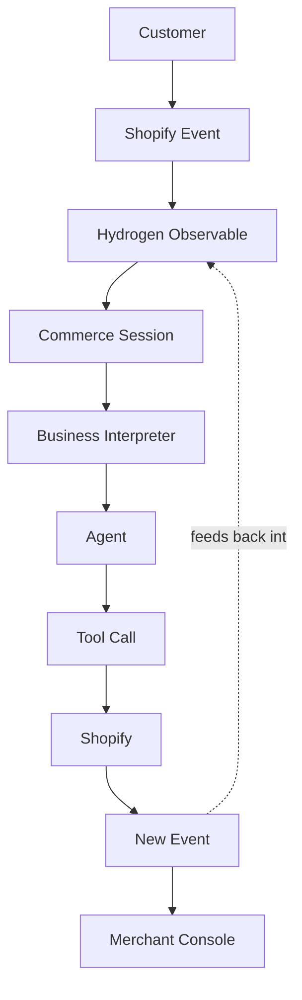
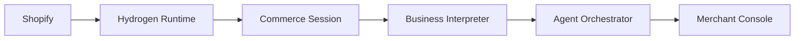
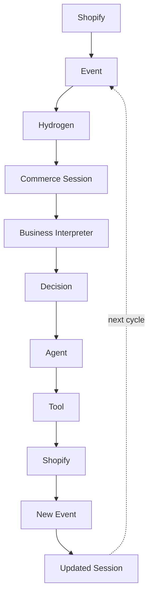

# Event System & Reactive Commerce Architecture

## Purpose

The rest of this document set describes a request-scoped world: a message comes in, a session is assembled, Claude is called, a response goes out (see [Architecture.md](./Architecture.md), [CommerceSession.md](./CommerceSession.md)). That model serves a single conversational surface well. It doesn't extend cleanly to "one brain, many surfaces" (per [Vision.md](./Vision.md)) — a PDP assistant, a cart-drawer assistant, and a Merchant Console dashboard all need to react to the *same* underlying commerce state changing, rather than each independently polling Shopify and reconstructing its own view of it.

This document describes the event-driven architecture IntentCart is designed around as Shopify's Hydrogen runtime evolves toward a reactive, agent-first model: standardized commerce events, observables, and Agent Skills. It answers four questions for whoever is building against this system:

- **Where does state live and flow?**
- **Who owns the truth, at each layer?**
- **Who listens to what?**
- **Who triggers what?**

## Philosophy

The product does not recompute commerce. It reacts to it.

- **Shopify remains the source of truth** for every commerce fact — cart, checkout, customer, inventory, price. The event system is a delivery mechanism for that truth, not a different owner of it.
- **Hydrogen provides a standardized reactive layer** over that truth — a consistent way to observe commerce state changing, so every consumer (chat agent, dashboard, future widget) subscribes to the same stream instead of writing its own polling or ad hoc refetch logic.
- **IntentCart orchestrates business decisions** on top of that reactive layer. It decides what a cart update *means* for the conversation, what an inventory change *means* for a pending recommendation, what a completed checkout *means* for the shopper experience — but it never decides what the cart total *is*.

## The seven layers

```
┌─────────────────────────────────────────────────────────────┐
│  Layer 1 — Shopify Commerce Platform                          │
│  Cart · Checkout · Customer · Products · Inventory ·           │
│  Collections · Policies · Metaobjects · Search · Analytics      │
│  THE source of truth. Owns every commerce fact.                 │
└──────────────────────────┬──────────────────────────────────┘
                            │ standard events
                            ▼
┌─────────────────────────────────────────────────────────────┐
│  Layer 2 — Hydrogen Runtime                                     │
│  Reactive Store Toolkit · Commerce State · Observables ·        │
│  Agent Skills · framework-agnostic, runtime-agnostic             │
│  Turns Shopify facts into a subscribable stream.                 │
└──────────────────────────┬──────────────────────────────────┘
                            │ observables
                            ▼
┌─────────────────────────────────────────────────────────────┐
│  Layer 3 — Hydrogen Agent Skills                                │
│  Cart math · checkout logic · analytics · consent ·             │
│  inventory sync · event contracts — as callable, official        │
│  Shopify knowledge, not reimplemented logic.                     │
└──────────────────────────┬──────────────────────────────────┘
                            │ used by
                            ▼
┌─────────────────────────────────────────────────────────────┐
│  Layer 4 — Commerce Session                                    │
│  Conversation · Merchant Context · Customer Context ·           │
│  Cart State · Checkout State · Current Intent ·                  │
│  Business Context · Memory · Observables                         │
│  The living memory of the commerce interaction.                 │
│  Reflects Shopify state — never owns it.                          │
└──────────────────────────┬──────────────────────────────────┘
                            │ events + state
                            ▼
┌─────────────────────────────────────────────────────────────┐
│  Layer 5 — Business Interpreter                                │
│  Events → Business Meaning                                     │
└──────────────────────────┬──────────────────────────────────┘
                            │ business meaning
                            ▼
┌─────────────────────────────────────────────────────────────┐
│  Layer 6 — Agent Orchestrator                                   │
│  Multi-agent reasoning. Never talks to Shopify directly.        │
└──────────────────────────┬──────────────────────────────────┘
                            │ actions + reasoning trace
                            ▼
┌─────────────────────────────────────────────────────────────┐
│  Layer 7 — Merchant Console                                     │
│  Supervises events, sessions, actions, reasoning,                │
│  tool calls, errors, business decisions.                         │
└─────────────────────────────────────────────────────────────┘
```

### Layer 1 — Shopify Commerce Platform

| Owns | Never delegated |
|---|---|
| Cart, Checkout, Customer, Products, Inventory, Collections, Policies, Metaobjects, Search, Analytics, Standard Events | Price, stock, availability, order state — no downstream layer holds its own copy of these as authoritative |

Shopify is the single source of truth, full stop — the same constraint stated in [Vision.md](./Vision.md) and [Architecture.md](./Architecture.md#design-commitments-that-constrain-future-work). The event system changes *how fast and how* every other layer learns about a change in Shopify, not *who's allowed to make the change*.

### Layer 2 — Hydrogen Runtime

Hydrogen, in this architecture, is a **reactive commerce state toolkit** rather than a rendering framework: a standardized way to observe Shopify commerce state changing, expose it as **Commerce State** and **Observables**, and package official Shopify business logic as **Agent Skills** — framework-agnostic and runtime-agnostic, so a React storefront, a chat backend, and an agent orchestrator all subscribe to the same standardized events instead of each implementing their own Shopify client.

This is the shift the agent-first Hydrogen direction represents: Hydrogen becomes the standardized commerce-reactivity layer that any runtime consumes — including a backend with no UI at all, like IntentCart's.

### Layer 3 — Hydrogen Agent Skills

Cart math, checkout logic, analytics event contracts, consent handling, and inventory sync all look simple until they've been shipped to production across thousands of stores, with edge cases around selling plans, partial availability, tax jurisdictions, markets, and currency rounding. Shopify has already solved these problems correctly, at scale, inside its own commerce engine. Agent Skills package that solved knowledge as **callable, official capability**, so an agent — or the coding agent building IntentCart — calls into it rather than maintaining a second, unofficial copy of logic Shopify already owns.

| An agent calls the Skill for | Rather than hand-rolling |
|---|---|
| Cart Skill | Line-item totals, discounts, taxes, shipping estimates |
| Checkout Skill | Readiness, selling-plan requirements, buyer-input gates |
| Analytics Skill | What fires, when, with what shape |
| Consent Skill | Cookie/marketing consent gating |
| Inventory Skill | What "available" means across locations/channels |
| Standard Events Skill | What a `cart/updated` event guarantees vs. doesn't |

For IntentCart, this changes the adapter layer's job from "call MCP and normalize the response" to "call the relevant Skill and trust its contract." Today's tolerant, ad hoc normalization in `tool.server.js` (see [Architecture.md](./Architecture.md#adapter-layer-design-intent)) exists precisely because there's no official normalized contract to lean on yet — Skills are the mechanism that removes that normalization burden from IntentCart entirely.

### Layer 4 — Commerce Session

Commerce Session is the living memory of the commerce interaction. It aggregates Conversation, Merchant Context, Customer Context, Cart State, Checkout State, Current Intent, Business Context, Memory, and Observables.

It does not own commerce — it reflects Shopify state, mediated through Hydrogen. This is the same non-negotiable stated in [CommerceSession.md](./CommerceSession.md) for the `CommerceSession` object in `app/services/commerce-session.server.js`; the event-driven architecture doesn't relax the constraint, it changes how the reflection stays current. The session subscribes to Hydrogen Observables and updates continuously as Shopify state changes, including changes that didn't originate from the current conversation — a price drop, a stock-out, a policy edit.

*Current implementation:* `commerce-session.server.js` realizes this layer as a per-request reconstruction from persisted message history, refreshed once at the start of each turn rather than continuously. It's an accurate reflection of what happened within the current conversation today; the Observable model above extends that reflection to state changes originating outside it.

### Layer 5 — Business Interpreter

The Business Interpreter turns raw events into business meaning an agent can reason about, rather than leaving every agent to independently infer what an event implies:

| Event | Business meaning |
|---|---|
| Cart Updated | Customer is buying |
| Inventory Changed (→ 0) | Offer became unavailable |
| Checkout Completed | Conversation closes |
| Policy Updated | A previously-given answer may now be wrong |

This layer interprets every event type in the table in the [Event types](#event-types) section below, as a standing subscriber on the event bus — invoked automatically whenever a relevant event fires, rather than called from a single code path.

*Current implementation:* `business-message-interpreter.server.js` already implements a narrower version of this translation — classifying cart tool outcomes into `quantity_adjusted`, `not_found`, `unavailable`, `requires_selling_plan`, and `requires_buyer_input` (see [CommerceSession.md](./CommerceSession.md#the-cart-adapter-path)). Routing today's cart flow through it, as described in [Roadmap.md](./Roadmap.md#near-term-architecture), is a direct step toward this layer and doesn't require the rest of the event system to exist first.

### Layer 6 — Agent Orchestrator

Agents never talk directly to Shopify. Every agent action is mediated:

```
Agent → Commerce Session → Business Interpreter → Hydrogen Skills → Shopify
```

This generalizes the agent model in [Agents.md](./Agents.md) into a multi-agent roster — Shopping Agent, Product Expert, Cart Agent, Checkout Agent, Support Agent — each subscribing to the event types relevant to its job rather than polling or being handed the entire commerce context on every turn. The orchestration discipline holds at any scale: no agent, whether the system runs one or five, gets a direct line to Shopify. That line always runs through the layers below it.

*Current implementation:* Sage realizes this layer today as a single agent, defined by one system prompt and one tool-use loop (`app/services/claude.server.js`) — see [Agents.md](./Agents.md).

### Layer 7 — Merchant Console

The Merchant Console is the supervision layer. It observes Events, Sessions, Actions, Reasoning, Tool Calls, Errors, and Business Decisions, so a merchant can understand what the AI is doing and why — auditing agent behavior after the fact, not only configuring it in advance. This is an additional module beyond the configuration scope in [MerchantConsole.md](./MerchantConsole.md) (Brand, Prompt & Rules, Widgets, Integrations, Permissions, Analytics, Experiments), and it depends on every layer above emitting a traceable event — precisely what an event-driven architecture provides.

## Event flow

**Detailed flow, one interaction:**



**Layer-level flow:**



The second diagram is the default mental model for the whole system: **truth flows down from Shopify, reasoning happens in the middle, supervision sits at the top.** Nothing skips a layer in either direction.

## Event types

| Category | Examples | Primary listener(s) |
|---|---|---|
| Cart Events | item added, item removed, quantity changed, cart abandoned | Commerce Session, Business Interpreter, Cart Agent |
| Checkout Events | checkout started, checkout completed, checkout failed | Business Interpreter, Merchant Console |
| Customer Events | logged in, order history updated, consent changed | Commerce Session, Support Agent |
| Product Events | price changed, description updated, variant added | Business Interpreter, Shopping Agent |
| Inventory Events | stock depleted, restocked, backorder state changed | Business Interpreter (drives "offer unavailable" reasoning) |
| Search Events | query issued, zero-result query, catalog re-indexed | Shopping Agent, Merchant Console (search-gap analytics) |
| Policy Events | shipping/returns/FAQ content updated | Business Interpreter (invalidates prior answers), Support Agent |
| Conversation Events | turn started, turn ended, clarification asked | Commerce Session, Agent Orchestrator |
| Merchant Events | brand/rules config changed, widget toggled | Agent Orchestrator (prompt/behavior updates), all agents |
| Internal Agent Events | tool called, tool failed, guardrail triggered, escalation raised | Merchant Console (supervision), Business Interpreter |

Every category has exactly one place it is defined as true — Shopify, for the first seven categories; IntentCart's own Runtime, for the last three — and every listener reacts to it rather than re-deriving it independently.

## Reactive commerce

The product does not poll. It listens.

- No layer re-fetches "just in case" on a timer. State changes propagate as events.
- Commerce Session updates as a relevant event fires — a price drop, a stock-out, a policy edit — even when that change didn't originate from the current shopper's turn.
- Agents make decisions against a **live** state snapshot, not one that was accurate when the conversation started and may since have gone stale.
- The Merchant Console shows a merchant what's happening as it happens, not only after a manual refresh.

This is the property the request/response model trades away for simplicity: `commerce-session.server.js` today reconstructs its view of the world once, at the start of a request, from persisted message history — accurate about what happened in *this* conversation, blind to what happened outside it. The reactive model makes "the commerce session is current" a property of the architecture rather than a property of how recently the shopper sent a message.

## Event lifecycle



Read this as a closed loop, not a one-way pipeline: the output of one cycle — an updated session, grounded in a new Shopify event — is the input to the next. There is no terminal state where the system stops listening; a conversation "ending" is itself just another event (Checkout Completed → conversation closes, per the Business Interpreter table above), not an exit from the loop.

## Guiding principles

- Shopify owns commerce.
- Hydrogen owns commerce state.
- Commerce Session owns business context.
- Business Interpreter owns meaning.
- Agents own reasoning.
- Merchant Console owns supervision.
- No duplicated commerce logic.
- No duplicated pricing logic.
- No duplicated checkout logic.
- IntentCart orchestrates.
- Shopify executes.

Each of these is a single-owner claim. Where two layers might plausibly both touch the same concern — both the Commerce Session and an Agent could plausibly "decide" what a cart change means — the resolution is fixed: interpretation belongs to the Business Interpreter, reasoning belongs to the Agent, and the Commerce Session only ever reflects. It doesn't interpret and it doesn't reason.

## Current Implementation

The architecture above describes the full seven-layer reactive system. Two layers have real, working counterparts in the codebase today, realized in the simpler request/response shape documented in [Architecture.md](./Architecture.md):

| Layer | Realized today as |
|---|---|
| Layer 1 — Shopify Commerce Platform | Live, via Storefront and Customer Account MCP (`app/mcp-client.js`) |
| Layer 4 — Commerce Session | `app/services/commerce-session.server.js`, reconstructed per request rather than continuously updated |
| Layer 5 — Business Interpreter | `app/services/business-message-interpreter.server.js`, implemented and pattern-matched to cart outcomes, pending routing into the live cart flow |
| Layer 6 — Agent Orchestrator | Sage, a single agent (`app/services/claude.server.js`), rather than a multi-agent roster |

Layers 2 (Hydrogen Runtime), 3 (Agent Skills), and 7 (Merchant Console supervision) are architecture without a current code counterpart — they describe the direction the platform is built toward as Hydrogen's reactive/agent-first capabilities mature, rather than a component being retrofitted into existing code.

## Future Evolution

Hydrogen, in this architecture, is the official reactive runtime sitting between Shopify and every agent that acts on commerce state — the standardized way any consumer observes commerce truth changing and calls into Shopify's own solved business logic instead of reimplementing it.

IntentCart does not compete with Hydrogen. It builds on it. Hydrogen supplies the reactive, standardized foundation; IntentCart uses that foundation to orchestrate business agents, maintain a living commerce memory, supervise agent decisions for the merchant, and deliver a conversational experience to shopper and merchant alike. This restates the "AI Commerce Operating System" positioning from [Vision.md](./Vision.md) in event-driven terms: Shopify executes, Hydrogen makes that execution observable, and IntentCart turns observability into orchestrated, accountable business decisions.

## Related documents

- [Vision.md](./Vision.md) — the product thesis this event model serves
- [Architecture.md](./Architecture.md) — the request/response implementation this architecture extends
- [CommerceSession.md](./CommerceSession.md) — today's per-turn reconstruction, and the Observable model it evolves into
- [Agents.md](./Agents.md) — today's single-agent model, and the event-subscribing orchestrator it evolves into
- [MerchantConsole.md](./MerchantConsole.md) — today's configuration scope, and the added supervision responsibility
- [Roadmap.md](./Roadmap.md) — sequencing (Long-Term Architecture)
