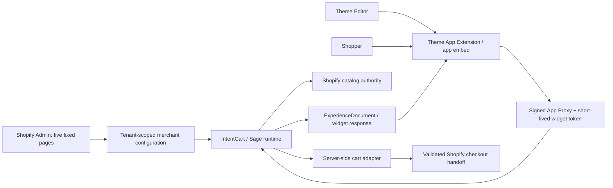

# Lab Role

## Identity

`shop-chat-agent-work` is the real Shopify distribution laboratory and the
current production-runtime candidate for IntentCart. It owns the embedded
Shopify application, tenant-safe server runtime, Theme App Extension, App Proxy
boundary, and Shopify cart/checkout handoff.

Its product rule is:

> Sage recommends. Shopify transacts.

## Mandate

This lab may:

- install and run the embedded IntentCart application on Shopify;
- configure merchant behavior through five fixed Admin surfaces;
- expose a thin storefront experience through a Theme App Extension;
- authenticate public widget traffic through Shopify App Proxy and short-lived
  credentials;
- read current Shopify catalog facts through approved server adapters;
- guide a shopper through intent, clarification, recommendation, comparison,
  variant resolution, explicit confirmation, cart, and checkout handoff;
- persist tenant-scoped configuration, sessions, experiments, recovery state,
  and audit evidence;
- provide the stable Shopify boundary consumed by the future Sage Core.

This lab may not:

- move intent, ranking, recommendation, or provider logic into Liquid or
  storefront JavaScript;
- replace Shopify as authority for products, variants, prices, stock, cart,
  checkout, or transaction outcome;
- create cart mutations without explicit product, variant, and quantity
  confirmation;
- duplicate Theme Editor appearance settings in the Admin dashboard;
- add a sixth primary Admin page;
- enable automatic widget opening;
- change OAuth scopes, deploy, or handle credentials as part of ordinary
  surface work.

## Fixed Merchant Surface

```text
Home
Assistant
Widget
Knowledge
Commerce
```

All provider, UCP, vertical, experimentation, recovery, personalization, and
analytics complexity must remain behind these five pages.

## Architecture Of Record



The Theme App Extension is an adapter and renderer. The runtime owns decisions.
Shopify owns commerce truth and transaction execution.

## Current Observed Shape

- The application uses React Router, Shopify App Bridge, Prisma, and PostgreSQL.
- `shopify.app.toml` declares an embedded app, required webhooks, App Proxy, and
  the `chat-bubble` Theme App Extension.
- `extensions/chat-bubble/blocks/chat-interface.liquid` is a body-targeted app
  embed. No separate app block was observed.
- Public requests pass through `app/security/app-proxy-context.server.js` and a
  short-lived credential from `app/security/widget-token.server.js`.
- Shopify session storage, webhook lifecycle, tenant isolation, durable cart
  idempotence, and validated checkout handoff are implemented and locally
  tested.
- Live Shopify installation and checkout evidence is not established by the
  repository alone.

Two current implementation gaps conflict with the target boundaries:

1. Storefront entry behaviors in `extensions/chat-bubble/assets/chat.js` can
   open inline, configured, or contextual surfaces without a direct shopper
   open action. The schema also exposes `open_on_load`.
2. `app/routes/app.widget.jsx` edits layout and behavior values that overlap
   settings exposed by the Theme Editor.

These are documented constraints for future product work. This agent-system
configuration does not silently rewrite them.

## Definition Of Success

The lab is ready to act as the Shopify distribution boundary when:

1. Installation, session rotation, uninstall, and reinstall are verified on
   authorized development stores.
2. Two-store isolation is proved end to end.
3. The widget always starts closed and Theme Editor has single ownership of
   appearance.
4. Search, three recommendations maximum, comparison, variant confirmation,
   idempotent cart mutation, and Shopify checkout handoff are verified live.
5. Mobile, keyboard, focus, reduced-motion, zoom, and representative theme
   compatibility checks pass.
6. Migrations, rollback, backup/restore, healthchecks, structured logs, and
   deployment revision are independently verified.
