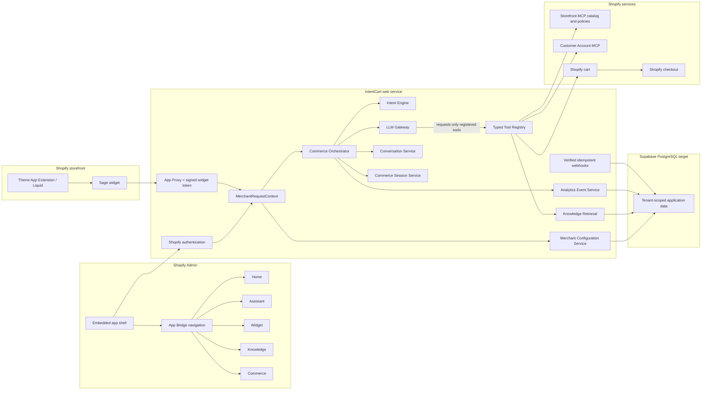
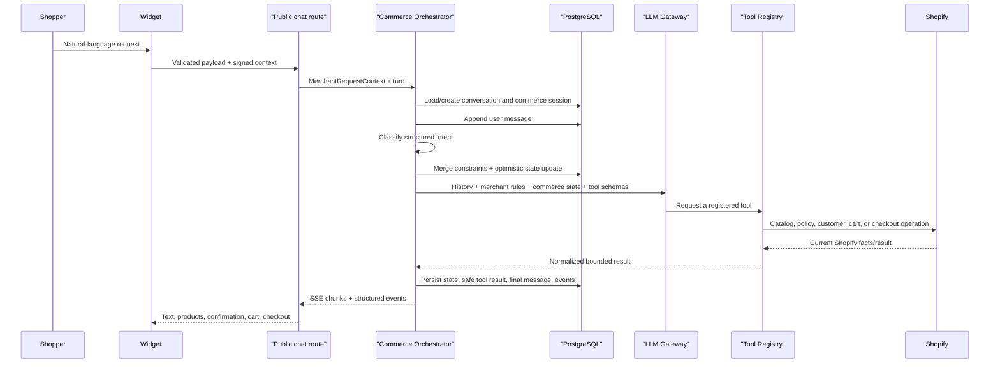
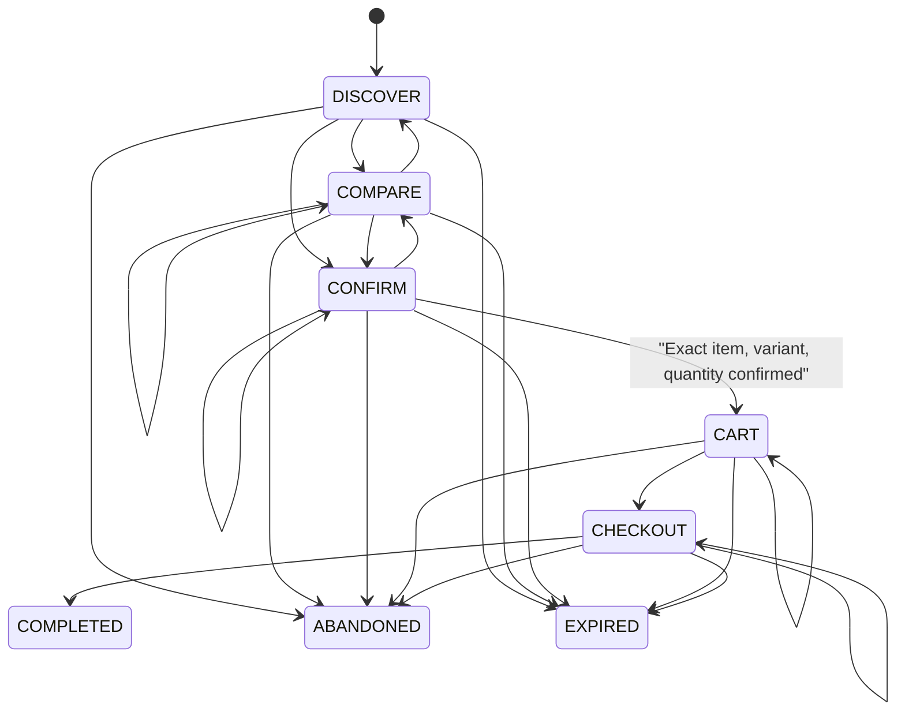
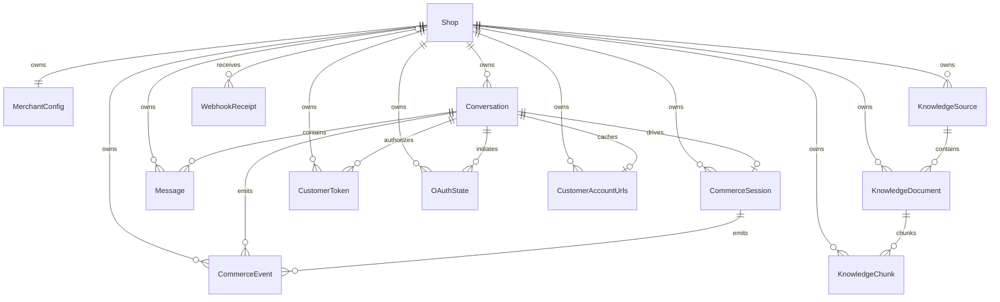

# IntentCart implemented architecture

Status: architecture hardening baseline, 2026-07-31.

This document is the authoritative implementation map. `architecture-audit.md`
describes the pre-hardening state and the risks that motivated this design.

## System boundaries

IntentCart owns conversation, intent, recommendation orchestration, merchant
configuration, knowledge retrieval, confirmation, and analytics events. Shopify
remains authoritative for products, variants, prices, inventory, policies,
customer identity, cart, checkout, and orders.



## Merchant admin architecture

The merchant dashboard has one navigation owner and five domain routes:

```text
Shopify Admin global navigation
└── IntentCart embedded application
    └── App Bridge s-app-nav
        ├── /app
        ├── /app/assistant
        ├── /app/widget
        ├── /app/knowledge
        └── /app/commerce
```

`app/routes/app.jsx` authenticates the embedded shell and registers App Bridge
navigation. It does not render a second in-page tab bar. Each child route owns a
focused page, authenticates through `loadIntentCartDashboard()`, derives a
server-side `MerchantRequestContext`, and reads the current shop configuration.

The admin responsibility split is deliberate:

| Surface | Owns |
|---|---|
| Shopify Admin + App Bridge | Authentication, embedding, primary app navigation |
| Home | Installation status and launch checklist |
| Assistant | Voice, welcome message, prompts, behavioral guardrails |
| Widget | Read-only view of storefront surface choices; Theme Editor owns visual placement |
| Knowledge | Approved source status and future source management |
| Commerce | Recommendation, confirmation, inventory, cart, and checkout rules |
| Theme Editor | Widget layout, position, colors, launcher, and activation |

The dashboard currently reads persisted configuration and preserves its existing
visual design. Authenticated write services exist, but no new editing UI was
introduced in this architecture pass.

## Storefront trust flow

The browser never proves its own shop identity. The preferred path is:

1. Liquid loads static widget assets and non-sensitive visual settings.
2. The widget calls the same-origin App Proxy bootstrap route.
3. Shopify verifies and forwards the signed App Proxy request.
4. The backend resolves the installed `Shop`, creates a server context, and
   issues a short-lived HMAC token bound to shop and storefront origin.
5. Chat, history, and token-status requests use either the signed App Proxy or
   that bearer token. The server revalidates the active shop.

The direct `/chat` compatibility route remains available for development, but it
requires the signed widget bearer token and an allowed origin. A browser-supplied
shop ID is never accepted as identity.

## Commerce turn



The LLM has no Prisma client and no arbitrary Shopify client. It can request only
the schemas exposed by `createToolRegistry()`. The orchestrator executes tools,
applies state patches, records events, and controls what reaches model context or
persistence.

## Commerce state machine



`CommerceSession.version` provides optimistic locking. An intent can move a
session to `CONFIRM`, but only a matching explicit second-turn confirmation can
invoke `update_cart` and move it to `CART`.

## Data model



All merchant-owned application tables carry `shopId`, use a foreign key to
`Shop`, and have indexes for their common tenant-scoped access paths. `Session`
is Shopify SDK storage and retains Shopify's canonical `shop` field.

Knowledge uses PostgreSQL `tsvector` plus a GIN index. Retrieval joins source,
document, and chunk through the same `shopId`, includes active sources/documents
only, and enforces result and character limits. `PgVectorRetriever` and
`HybridRetriever` are extension points only; no embeddings are generated.

## Service inventory

| Responsibility | Implementation |
|---|---|
| Shop lifecycle | `app/services/shop.server.js` |
| Request identity | `app/security/merchant-context.server.js` |
| App Proxy identity | `app/security/app-proxy-context.server.js` |
| Widget credentials | `app/security/widget-token.server.js` |
| Merchant configuration | `app/merchant/merchant.server.js` |
| Conversations/history | `app/services/conversation.server.js` |
| Commerce state | `app/services/commerce-session.server.js` |
| Intent | `app/services/intent-router.server.js` |
| Orchestration | `app/services/commerce-orchestrator.server.js` |
| Model provider boundary | `app/services/llm-gateway.server.js` |
| Controlled tools | `app/services/tool-registry.server.js` |
| Knowledge | `app/services/knowledge.server.js` |
| Shopify adapters | `app/services/*-adapter.server.js`, `app/mcp-client.js` |
| Customer OAuth/tokens | `app/auth.server.js`, `app/services/oauth-state.server.js`, `app/services/customer-token.server.js` |
| Events | `app/services/analytics-event.server.js` |
| Webhooks | `app/routes/api.webhooks.jsx`, `app/services/webhook.server.js` |
| Logs | `app/lib/logger.server.js` |

## Registered LLM tools

- `search_catalog`
- `get_product_details`
- `retrieve_brand_knowledge`
- `compare_products`
- `get_cart`
- `update_cart`
- `create_checkout_handoff`

Inputs are Zod-validated, model-visible JSON schemas disallow extra properties,
catalog results are capped at three, cart IDs are session-bound, and checkout
URLs are restricted to the canonical or configured storefront host.

## Corrected risks

- Browser-selected shop identity replaced with Shopify App Proxy verification
  and a short-lived origin-bound credential.
- Open CORS reflection replaced with allowlist/canonical-origin checks.
- Shopify domains and externally supplied URLs are normalized and validated.
- Widget output uses DOM text nodes and validated links rather than raw HTML.
- Public payload, response, and message sizes are bounded.
- External requests and LLM calls have timeouts and neutral public errors.
- Customer tokens use AES-256-GCM at rest and stay server-side.
- OAuth state is random, hashed, expiring, shop-scoped, and atomically one-shot.
- Merchant configuration, conversation, knowledge, and commerce state are
  tenant-scoped PostgreSQL records.
- Commerce state is persistent and protected by optimistic locking.
- Cart mutation requires exact product, variant, quantity, and confirmation.
- One orchestrated tool path replaces catalog prefetch plus duplicate LLM calls.
- Webhooks are verified by Shopify, transactional, and idempotent by receipt ID.
- Logs and persisted tool results recursively redact common secret/PII fields.

## Residual risks and manual controls

- In-memory rate limiting is process-local. Move the same interface to Redis
  before horizontal scaling or high-volume abuse exposure.
- The App Proxy prefix/subpath can be customized in Shopify Admin. The widget
  supports a relative configured backend path, but merchants must keep that
  Theme Editor value aligned with a customized proxy path.
- `customers/data_request` validates and records the request but still requires
  a documented human export response; no background compliance worker exists.
- RLS is not enabled. Server-side `shopId` controls are primary; RLS requires a
  non-bypass database role and transaction-local tenant identity before use.
- Customer Account MCP and live cart behavior still require end-to-end testing
  against a real development store after environment configuration.
- PostgreSQL migrations have not been applied to a remote database in this work.
- React Router `7.18.2` still appears in npm advisory
  `GHSA-qwww-vcr4-c8h2`, which applies to RSC mode. This application does not
  enable RSC, and no patched React Router release is currently available; keep
  the dependency under review before deployment.
- The first PostgreSQL cutover needs the documented SQLite export/import plan;
  the foundation migration intentionally does not guess legacy tenant ownership.

## Preserved extension points

The current contracts permit future model providers, pgvector/hybrid retrieval,
workers, Redis rate limiting, Hydrogen storefronts, Catalog API, UCP, external
agents, additional widget surfaces, and merchant analytics. None of those future
systems are active in the MVP baseline.
