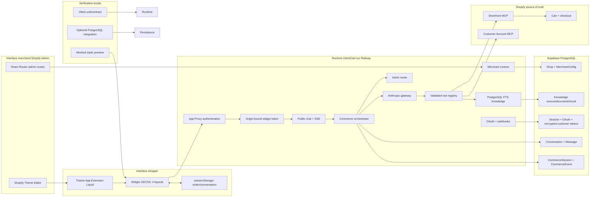

# Intent card shopify - Audit du laboratoire

> Historical pre-stabilization snapshot. Use
> `docs/execution/PRODUCTION_RUN.md` and `PROMOTION_MANIFEST.json` for the
> current candidate implementation, tests, and deployment status.

Audit effectue les 31 juillet et 1er aout 2026. Le perimetre principal est le depot autonome courant. Les espaces voisins accessibles dans le monorepo parent sont consultes uniquement pour etablir les chevauchements.

## Vocabulaire de preuve

- **Observe** : lu dans le code, Git, une configuration, un test execute ou une interface externe en lecture seule pendant cet audit.
- **Documente, non verifie** : affirme dans un document, sans preuve runtime actuelle.
- **Inference** : conclusion raisonnable tiree de plusieurs preuves, explicitement signalee.
- **Hypothese** : piste non prouvee.
- **Inconnu** : information non accessible ou non determinable sans mutation, secret ou test externe supplementaire.

Les etats Git ci-dessous sont ceux observes avant la creation des deux livrables d'audit. Les modifications deja presentes dans `docs/PROJECT_STATE.md`, `docs/Vision.md` et `docs/Positioning.md` sont attribuees a l'utilisateur et n'ont pas ete touchees.

## 1. Carte d'identite

| Champ                         | Valeur                                                                                   | Niveau de preuve                                   |
| ----------------------------- | ---------------------------------------------------------------------------------------- | -------------------------------------------------- |
| Nom du lab demande            | Intent card shopify                                                                      | Fourni par l'utilisateur                           |
| Nom visible de la tache Codex | `Intent Card_SHOPIFY`                                                                    | Observe dans la capture fournie                    |
| Nom de l'application          | IntentCart                                                                               | Observe dans le code et la configuration Shopify   |
| Nom du bot shopper            | Sage                                                                                     | Observe dans l'UI, les prompts et la documentation |
| Nom du package                | `shop-chat-agent`                                                                        | Observe dans `package.json`                        |
| Depot Git                     | `0xplug75/shop-chat-agent`                                                               | Observe via Git                                    |
| Type d'espace                 | Depot Git autonome imbrique dans un autre worktree                                       | Observe                                            |
| Role produit                  | Fondation Shopify native de vente guidee agentique                                       | Inference appuyee par le code et le positionnement |
| Maturite                      | **Working with limitations** - fondation RC deployee, pas une production generale fiable | Synthese de l'audit                                |

Identite en une phrase : **IntentCart est la fondation Shopify de Sage qui transforme une intention shopper en recherche, comparaison, confirmation, panier et handoff checkout, tout en laissant Shopify posseder les donnees et la transaction.**

## 2. Resume executif

Ce lab n'est pas un simple prototype de page. C'est un depot Shopify autonome contenant une application embarquee React Router, une Theme App Extension Liquid/JavaScript, un runtime multiboutique, un orchestrateur commerce, des contrats Zod, une persistance PostgreSQL et des adaptateurs Shopify MCP. Il est versionne sur GitHub et une revision proche de `HEAD` est effectivement deployee sur Railway avec une base Supabase accessible.

La fondation locale est coherente : 35 tests passent, 4 tests PostgreSQL sont volontairement ignores faute de base jetable configuree, le typecheck, le lint et le build passent. Les healthchecks Railway et base retournent HTTP 200. Les limites sont toutefois bloquantes pour une production multimarchand : l'appel Anthropic du parcours live retourne actuellement une erreur 400, l'application embarquee Shopify charge encore une ancienne origine Cloudflare devenue invalide, et la table de sessions ne persiste pas les nouveaux champs de rotation des jetons hors ligne requis pour les nouvelles applications publiques Shopify.

L'actif principal n'est pas le dashboard actuel. C'est la combinaison suivante : frontiere de confiance App Proxy + jeton widget court, contexte marchand, contrats de commerce, session persistante, registre d'outils valide, confirmation exacte avant panier et handoff vers Shopify. Le dashboard marchand est surtout une vue de controle en lecture seule ; il ne constitue pas encore un Merchant OS editable.

Decision recommandee : **ADAPT** la fondation actuelle comme runtime Shopify de Sage, promouvoir certains contrats et controles tels quels, puis bloquer toute qualification "production multimarchand" tant que les trois P0 ne sont pas leves et qu'un E2E reel n'a pas ete execute.

## 3. Je suis / je fais / je peux

> Je suis **IntentCart, le socle Shopify du produit Sage**, conserve dans le depot `shop-chat-agent` et visible dans Codex sous le nom `Intent Card_SHOPIFY`.
>
> J'ai ete cree pour **reduire l'intent-to-catalog gap** : comprendre une demande, interroger les faits Shopify, proposer une courte liste, confirmer la variante et la quantite, puis rendre l'execution a Shopify.
>
> Je sais actuellement **afficher quatre formes de widget, securiser un bootstrap App Proxy, maintenir des conversations et sessions commerce par boutique, classifier une intention, appeler des outils Shopify MCP, persister les evenements et preparer panier/checkout**.
>
> Je ne sais pas encore **garantir un agent live disponible, changer de provider LLM, editer toute la configuration depuis l'admin, ingerer une base de connaissance marchande, fonctionner en haute disponibilite ni prouver le parcours achat complet par un E2E**.
>
> Mon actif principal est **le runtime Shopify multitenant et ses garde-fous contractuels**, pas l'interface de dashboard.
>
> Mon niveau de maturite est **Working with limitations : RC technique deployee, non prete pour une diffusion generale**.

Cas utilisateur principal observe : un shopper ouvre Sage depuis une boutique Shopify, decrit son besoin, recoit au plus trois produits fondes sur les donnees live, compare, confirme un article/une variante/une quantite, puis continue dans le panier et le checkout Shopify.

Utilisateur marchand cible observe : un operateur Shopify qui verifie l'assistant, les sources, les regles de commerce et l'apparence du widget, avec les controles visuels places dans le Theme Editor.

Apprentissage produit deja stabilise : **Sage recommande, Shopify transacte**. Le runtime ne doit ni dupliquer le catalogue ni faire croire qu'une mutation panier a reussi sans retour d'un outil Shopify.

## 4. Emplacement reel

### Carte des espaces

```text
Monorepo parent (..)
|-- apps/web/app/intent-card/                 demo shopper CIE, sans dependance runtime
|-- labs/catalog-kit-intent-card/             contrats catalogue experimentaux
|-- labs/magpie-intent-finder/                intention et recherche verticale
|-- labs/hydrogen-intent-card/                etude documentaire Hydrogen
`-- shop-chat-agent-work/                     depot autonome audite ici
```

| Espace                                   | Nature                                     | Depot/branche                                               | Relation avec le lab courant                                                 |
| ---------------------------------------- | ------------------------------------------ | ----------------------------------------------------------- | ---------------------------------------------------------------------------- |
| `.`                                      | Depot autonome autoritatif pour IntentCart | `0xplug75/shop-chat-agent`, `codex/intentcart-admin-freeze` | Code audite et source de la revision deployee                                |
| `..`                                     | Monorepo Creative Intelligence Engine      | `Sundaravelss/creative-intelligence-engine`                 | Contient les labs voisins et la demo, mais ne versionne pas le depot courant |
| `../labs/catalog-kit-intent-card`        | Sous-dossier isole                         | Depot parent                                                | Contrats a comparer, aucune importation depuis IntentCart                    |
| `../labs/magpie-intent-finder`           | Sous-dossier isole                         | Depot parent                                                | Recherche/intention a comparer, aucune importation depuis IntentCart         |
| `../labs/hydrogen-intent-card`           | Sous-dossier documentaire                  | Depot parent                                                | Etude et audit seulement, aucun runtime                                      |
| `../apps/web/app/intent-card`            | Route de demo du produit CIE               | Depot parent                                                | Experience shopper similaire, aucune dependance de code observee             |
| `../recurmind-app`, `../tmp/RECURMINDV0` | Autres depots detectes                     | Non audites en profondeur                                   | Aucune dependance directe observee                                           |

Le nom de la tache Codex n'est donc pas un dossier. Le dossier autoritatif est `shop-chat-agent-work/`, lui-meme non suivi par le depot parent mais possedant son propre `.git` et son propre remote de production.

### Git observe

| Champ           | Valeur                                                             |
| --------------- | ------------------------------------------------------------------ |
| Branche         | `codex/intentcart-admin-freeze`                                    |
| HEAD            | `43ae66e4c5b9de4f3bbc74a043701d784febdb8d`                         |
| Date HEAD       | 2026-07-31 23:23:05 +02:00                                         |
| Message HEAD    | `chore(shopify): remove obsolete deploy flag`                      |
| Remote nettoye  | `https://github.com/0xplug75/shop-chat-agent.git`                  |
| Etat initial    | Deux fichiers modifies et un document non suivi, tous preexistants |
| Sous-modules    | Aucun                                                              |
| Worktrees       | Un seul                                                            |
| Tags            | Aucun                                                              |
| CI versionnee   | Aucune configuration CI trouvee                                    |
| Fichiers suivis | 142                                                                |

Branches significatives observees : `main` reste au template Shopify amont (`29b164b`), tandis que les branches `codex/agentic-buying-mode`, `codex/commerce-session-engine` et `codex/intentcart-admin-freeze` portent les evolutions IntentCart. Le produit courant vit donc hors de `main`.

### Outillage

- Gestionnaire : npm avec `package-lock.json`.
- Runtime : Node.js `>=20.10`.
- Frontend/admin : React 18, React Router 7, Shopify App Bridge web components.
- Backend : route modules React Router, services JavaScript, Zod.
- Persistance : Prisma 6 et PostgreSQL/Supabase.
- Storefront : Theme App Extension Liquid, JavaScript et CSS sans framework client.
- IA : SDK Anthropic uniquement dans le runtime actuel.
- Tests : Vitest, avec suite PostgreSQL optionnelle.
- Deploiement : Docker multi-stage et Railway.

## 5. Statut local / Git / staging / production

### Local

Statut : **Working with limitations**.

- Lancement principal documente : `npm run dev`, qui passe par Shopify CLI et une URL de tunnel dynamique.
- Build autonome : `npm run build`, puis `npm run start` avec un environnement complet.
- Preview visuelle : `preview/index.html`, qui charge les vrais assets du widget mais intercepte `fetch` et simule trois produits et un flux SSE.
- PostgreSQL local optionnel : `infra/docker-compose.postgres.yml`, port documente `5433`.
- `prisma/dev.sqlite` est un ancien fichier local ignore ; le schema courant exige PostgreSQL.
- Prerequis critiques : configuration Shopify, deux URLs PostgreSQL, cle LLM, secrets de signature/chiffrement et origine storefront.
- Derniere preuve locale : tests, typecheck, lint et build executes le 2026-08-01 pendant cet audit.

### Versionne

Statut : **Verified live** pour Git, pas pour une release taggee.

- Depot GitHub : <https://github.com/0xplug75/shop-chat-agent>.
- Branche distante synchronisee avec `HEAD` : `origin/codex/intentcart-admin-freeze`.
- Aucun tag de release ou RC n'existe, meme si le commit `6fa27ec` se nomme "freeze ... RC1".
- Aucun workflow CI/CD versionne n'a ete trouve ; Railway deploye depuis GitHub.
- Le worktree utilisateur etait deja sale avant l'audit ; aucune modification utilisateur n'a ete annulee.

### Staging ou preview

Statut : **Unknown** pour un environnement staging distinct.

- Aucun projet Railway staging, aucune URL preview durable et aucune base staging n'ont ete prouves.
- La preview locale est **Mocked**, pas un environnement distant.
- Une execution Shopify CLI avec tunnel a existe auparavant ; l'origine actuellement enregistree dans l'admin Shopify pointe encore vers un ancien domaine `trycloudflare.com` qui ne se resout plus.

### Production

| Element                | Statut                                      | Preuve actuelle                                                                          | Limite                                                  |
| ---------------------- | ------------------------------------------- | ---------------------------------------------------------------------------------------- | ------------------------------------------------------- |
| Service Railway        | **Verified live**                           | Projet `luminous-stillness`, service `shop-chat-agent`, health HTTP 200                  | Une seule replica en US West                            |
| URL publique           | **Verified live**                           | <https://shop-chat-agent-production-3220.up.railway.app>                                 | Liveness seulement, pas un E2E shopper                  |
| Base Supabase          | **Verified live**                           | Projet `Intent Card_SHOPIFY`, PostgreSQL 17.6, migrations appliquees, readiness HTTP 200 | Region Europe du Nord, distante du service US West      |
| Revision deployee      | **Verified live**                           | `4f92c75257074a3e28ec3c0301043c93bf614933` observee dans Railway                         | `HEAD` est un commit de configuration plus recent       |
| Ecart avec HEAD        | Observe                                     | Une suppression d'une ligne obsolete dans `shopify.app.toml`                             | Faible ecart de code, mais pas nul                      |
| Embedded admin Shopify | **Previously deployed**, actuellement casse | Application installee, iframe dirigee vers une ancienne origine Cloudflare               | DNS invalide ; l'admin ne charge pas le service Railway |
| Theme App Extension    | **Previously deployed**                     | Widget/app embed observe auparavant dans le Theme Editor                                 | Version/release Shopify actuelle non re-verifiee        |
| Agent Sage live        | **Implemented but blocked**                 | MCP Storefront et Customer connectes dans les logs ; appel Anthropic 400                 | Cause exacte inconnue                                   |
| Storefront public      | **Unknown**                                 | La boutique accessible redirige vers une page protegee                                   | Widget actuel non verifiable publiquement               |

Healthchecks GET relances le 2026-08-01 : `/health` retourne `{"ok":true}` et `/health/db` retourne `{"ok":true,"database":"ready"}`, tous deux avec HTTP 200.

Le tableau de bord Railway observe une image Docker construite depuis GitHub, huit migrations appliquees et aucun volume persistant. Supabase est la source durable. Les inspections ont ete faites en lecture seule ; aucun deploiement ni mutation n'a ete declenche.

## 6. Objectif initial

L'historique Git montre une origine dans le template officiel Shopify React Router, puis une serie d'etapes :

1. Octobre 2025 : base Shopify, App Proxy, MCP de developpement et authentification.
2. Juillet 2026 : mode shopping agentique, preview locale, session commerce et correctifs du flux live.
3. Juillet 2026 : configuration marchande, dashboard, quatre layouts de widget et durcissement multitenant PostgreSQL.
4. 31 juillet 2026 : gel RC1, Railway/Supabase, OAuth separe et durcissement de deploiement.

La question de recherche initiale est devenue une fondation produit : **comment convertir une demande naturelle en decisions commerciales Shopify verifiables sans dupliquer le catalogue ni le checkout ?**

L'experience testee est la vente guidee conversationnelle. La promesse documentee dans le positionnement est "Turn your Shopify store into an agentic shopping experience" ; le probleme est "The intent-to-catalog gap" ; la categorie est "Agentic guided selling for Shopify".

Ce qui est demontre : frontieres de confiance, session commerce, outils valides, courte recommandation, UI multiforme, persistance par boutique et handoff Shopify.

Ce qui est simule : les produits et le flux de la preview locale, les indicateurs du dashboard et les sources "actives" affichees quand elles ne correspondent pas a une ingestion locale.

Ce qui est volontairement differe : analytics marchand, integrations CRM, UCP, Hydrogen, documents marchands, providers LLM multiples, haute disponibilite et supervision.

## 7. Fonctionnalites et maturite

| Fonctionnalite          | Description                                                         | Fichier/preuve                                        | Statut                   | Testee                       | Deployee            | Limites                                                                         |
| ----------------------- | ------------------------------------------------------------------- | ----------------------------------------------------- | ------------------------ | ---------------------------- | ------------------- | ------------------------------------------------------------------------------- |
| Navigation admin        | Routes Home, Assistant, Widget, Knowledge, Commerce                 | `app/routes/app*.jsx`                                 | Working with limitations | Build/typecheck              | Oui                 | Lecture seule ; iframe Shopify actuelle cassee                                  |
| Configuration marchande | Assistant et regles par boutique avec version optimiste             | `app/merchant/merchant.server.js`, `MerchantConfig`   | Partial                  | Unit tests indirects         | Oui                 | Widget/analytics/integrations reviennent toujours du seed ; aucune action admin |
| Theme App Extension     | App embed Liquid avec quatre layouts et reglages Theme Editor       | `extensions/chat-bubble/`                             | Working with limitations | Build + verification de code | Previously deployed | Pas de test visuel automatise, release actuelle inconnue                        |
| Bootstrap App Proxy     | Verifie la signature Shopify et emet un jeton court lie a l'origine | `widget.bootstrap.jsx`, `app-proxy-context.server.js` | Working                  | Tests securite               | Oui                 | Dependance aux URLs Shopify correctement publiees                               |
| Jeton widget            | HMAC, version 1, TTL court, boutique et origine                     | `widget-token.server.js`                              | Working                  | Oui                          | Oui                 | Rotation/revocation centralisee absente                                         |
| Chat SSE                | Flux de texte, outils, produits, etat panier et erreurs             | `chat-request.server.js`, `streaming.server.js`       | Working with limitations | Contrats/streams             | Oui                 | Le provider live echoue actuellement                                            |
| Agent Sage live         | Boucle Anthropic avec outils Shopify                                | `llm-gateway.server.js`, Railway                      | Broken                   | Mock/unit seulement          | Oui                 | Anthropic HTTP 400 en production                                                |
| Intent routing          | Extraction structuree LLM puis fallback deterministe EN/FR/ES       | `intent-router.server.js`                             | Working with limitations | Oui                          | Oui                 | Taxonomie/categories heuristiques etroites                                      |
| Recherche catalogue     | Recherche Shopify MCP, normalisation et limite de trois             | `catalog-adapter.server.js`, registre d'outils        | Working with limitations | Oui                          | Oui                 | Qualite live non evaluee ; depend du MCP                                        |
| Politiques / FAQ        | Recherche locale FTS puis fallback Customer/Storefront MCP          | `knowledge.server.js`, `policy-adapter.server.js`     | Partial                  | Unit + integration ignoree   | Oui                 | Aucune source locale active observee                                            |
| Comparaison             | Compare 2-3 produits deja presents dans la session                  | `tool-registry.server.js`                             | Working                  | Oui                          | Oui                 | Pas d'evaluation de pertinence live                                             |
| Confirmation panier     | Deux tours, correspondance produit/variante/quantite, cart binding  | `tool-registry.server.js`, orchestrateur              | Working with limitations | Oui                          | Oui                 | Aucun E2E Shopify complet execute                                               |
| Checkout handoff        | Accepte uniquement l'URL issue du panier Shopify                    | `checkout-adapter.server.js`, widget                  | Partial                  | Unit                         | Oui                 | Handoff live non prouve pendant l'audit                                         |
| CommerceSession         | Etat persistant, transitions, expiration et verrouillage optimiste  | `commerce-session.server.js`, Prisma                  | Working                  | Oui                          | Oui                 | Nettoyage depend d'un script externe non planifie ici                           |
| Customer Account OAuth  | Etat one-shot, PKCE chiffre, tokens client chiffres                 | services OAuth/token                                  | Working with limitations | Oui                          | Oui                 | E2E OAuth actuel non verifie                                                    |
| Webhooks                | Desinstallation, conformite et idempotence                          | `api.webhooks.jsx`, `webhook.server.js`               | Working                  | Oui                          | Oui                 | Livraison Shopify actuelle non re-testee                                        |
| Evenements analytics    | Journal d'evenements commerce sanitise par boutique                 | `analytics-event.server.js`, `CommerceEvent`          | Partial                  | Oui                          | Oui                 | Pas de pipeline, retention, dashboard ou attribution                            |
| Knowledge ingestion     | Sources, documents, chunks et FTS                                   | Prisma, `knowledge.server.js`                         | Partial                  | Integration documentee       | Oui                 | Pas d'UI ni job d'ingestion ; tables vides observees                            |
| Preview autonome        | UI widget avec produits et SSE locaux simules                       | `preview/index.html`                                  | Mocked                   | Manuel                       | Non                 | Ne prouve ni Shopify ni LLM                                                     |
| Providers LLM multiples | OpenAI, Kimi ou autre backend interchangeable                       | Variables et intention architecturale                 | Documented only          | Non                          | Non                 | Seul Anthropic est importe et accepte                                           |
| UCP / Hydrogen          | Portabilite commerce future                                         | Documents et espaces voisins                          | Documented only          | Non                          | Non                 | Aucun adapter runtime courant                                                   |
| Haute disponibilite     | Replicas, Redis, worker et alertes                                  | Runbook/architecture cible                            | Documented only          | Non                          | Non                 | Une replica et rate limiter en memoire                                          |

## 8. Architecture

### Architecture reellement observee



### Flux principaux

**Lecture admin**

1. Shopify App Bridge charge une route `/app/*`.
2. Le loader authentifie la session admin et resout la boutique canonique.
3. `dashboard.server.js` assemble des donnees marchandes lisibles.
4. `merchant.server.js` charge ou cree la configuration par boutique dans PostgreSQL.
5. Les routes rendent une vue de controle ; aucune route admin ne sauvegarde les formulaires.

**Bootstrap storefront**

1. Liquid charge les reglages visuels non sensibles et les assets statiques.
2. Le widget appelle `/apps/intentcart/bootstrap` par Shopify App Proxy.
3. Le serveur verifie la signature App Proxy, la boutique et l'origine.
4. Il retourne une configuration publique reduite et un jeton HMAC court.
5. Le navigateur conserve seulement des identifiants de visite et conversation dans `sessionStorage`.

**Tour de commerce**

1. Le message est borne a 2 000 caracteres et valide.
2. Le contexte marchand vient du jeton/App Proxy, jamais d'un ID boutique fourni librement.
3. La conversation et la session commerce sont creees ou relues avec filtres `shopId`.
4. Le moteur d'intention tente une sortie structuree LLM puis utilise un fallback deterministe si necessaire.
5. L'orchestrateur appelle Anthropic avec le contexte, les regles marchandes et sept outils autorises.
6. Chaque appel d'outil est valide par Zod, execute via les adapters MCP/knowledge puis applique a la session.
7. Texte, outils, produits, erreurs et etat panier sont envoyes en SSE.
8. Messages et evenements sanitises sont persistes dans Supabase.

**Panier et checkout**

1. Un produit doit provenir de la session et une variante doit etre disponible.
2. Le premier appel construit une demande de confirmation exacte.
3. Un message shopper explicite et correspondant doit accepter le meme produit, la meme variante et la meme quantite.
4. L'adapter met alors a jour le panier Shopify.
5. Le checkout reste une URL Shopify validee et transmise au navigateur.

### Composants majeurs

| Composant            | Entree                                                | Role                                                    |
| -------------------- | ----------------------------------------------------- | ------------------------------------------------------- |
| Application admin    | `app/routes/app.jsx`                                  | Authentification, navigation et layout Shopify          |
| Pages admin          | `app/routes/app.*.jsx`                                | Vues de controle Assistant/Widget/Knowledge/Commerce    |
| Extension storefront | `extensions/chat-bubble/blocks/chat-interface.liquid` | Schema Theme Editor et bootstrap markup                 |
| Runtime widget       | `extensions/chat-bubble/assets/chat.js`               | Etats UI, auth, SSE, cartes produit et handoff          |
| Contexte marchand    | `app/security/merchant-context.server.js`             | Frontiere tenant/request                                |
| App Proxy            | `app/security/app-proxy-context.server.js`            | Verification de la requete Shopify                      |
| Orchestrateur        | `app/services/commerce-orchestrator.server.js`        | Chemin unique intention -> LLM -> outils -> persistance |
| Contrats             | `app/contracts/commerce.schemas.server.js`            | Validation runtime des entrees publiques et outils      |
| Registre d'outils    | `app/services/tool-registry.server.js`                | Allowlist et garde-fous commerce                        |
| Gateway LLM          | `app/services/llm-gateway.server.js`                  | Boucle Anthropic et erreurs normalisees                 |
| Etat commerce        | `app/services/commerce-session.server.js`             | Machine d'etat persistante et optimiste                 |
| Knowledge            | `app/services/knowledge.server.js`                    | CRUD/chunking et recherche FTS tenant-scoped            |
| Schema donnees       | `prisma/schema.prisma`                                | Source de verite des 12 modeles PostgreSQL              |
| Deploiement          | `Dockerfile`, `railway.json`                          | Image, migration pre-deploy, health et restart          |

## 9. Inventaire documentaire

| Chemin                                               | Titre / objectif                          | Date Git                       | Statut              | Coherence avec le code                                                          |
| ---------------------------------------------------- | ----------------------------------------- | ------------------------------ | ------------------- | ------------------------------------------------------------------------------- |
| `README.md`                                          | Boot et vue d'ensemble du template/app    | 2026-07-31                     | contradictoire      | Stack utile, mais affirme que le deploiement n'a pas eu lieu                    |
| `CHANGELOG.md`                                       | Historique du template Shopify            | 2025-10-07                     | historique          | Ne couvre pas les releases IntentCart                                           |
| `docs/Positioning.md`                                | Positionnement produit, ICP et validation | Non versionne                  | canonique           | Actuel strategiquement ; modification utilisateur non commitee                  |
| `docs/Vision.md`                                     | Vision et principes de Sage/Runtime       | 2026-07-03, modifie localement | canonique           | Coherent au niveau principes, futur au niveau surfaces                          |
| `docs/architecture-target.md`                        | Architecture implementee                  | 2026-07-31                     | canonique           | Document technique le plus proche du code courant                               |
| `docs/testing.md`                                    | Commandes et acceptation                  | 2026-07-31                     | utile               | Correct, mais parle de sept migrations alors qu'il y en a huit                  |
| `docs/DESIGN.md`                                     | Systeme de design admin/widget            | 2026-07-31                     | utile               | Coherent avec l'UI actuelle, certaines surfaces restent descriptives            |
| `docs/implementation-report.md`                      | Rapport de mise en oeuvre                 | 2026-07-31                     | utile               | Inventaire code fiable ; section deploiement devenue obsolete                   |
| `docs/deployment/railway-supabase.md`                | Runbook Railway/Supabase                  | 2026-07-31                     | utile               | Procedure utile, statut "non deploye" obsolete                                  |
| `docs/data/sqlite-to-postgres.md`                    | Guide de migration locale                 | 2026-07-31                     | utile               | Compatible avec le schema courant, operation non requise pour la base live      |
| `docs/architecture-audit.md`                         | Audit avant durcissement                  | 2026-07-31                     | historique          | Les risques listes expliquent les commits suivants ; plusieurs sont corriges    |
| `docs/PROJECT_STATE.md`                              | Etat projet et roadmap                    | 2026-07-31, modifie localement | contradictoire      | En-tete recent, corps encore JSON/Supabase futur et references anciennes        |
| `docs/Architecture.md`                               | Vue quatre couches et ancien flux         | 2026-07-31                     | obsolete            | Decrit `chat.jsx`/`claude.server.js` plutot que l'orchestrateur/gateway courant |
| `docs/MerchantConsole.md`                            | Architecture du dashboard marchand        | 2026-07-31                     | obsolete            | Decrit cache JSON et Supabase futur ; le code utilise deja Prisma               |
| `docs/CommerceSession.md`                            | Ancienne reconstruction de session        | 2026-07-03                     | historique          | Concept utile, chemin panier et persistance depasses                            |
| `docs/Agents.md`                                     | Sage, prompts, garde-fous et roster       | 2026-07-03                     | utile               | Garde-fous pertinents, imports et capacites analytics depasses                  |
| `docs/EventSystem.md`                                | Architecture reactive Hydrogen cible      | 2026-07-03                     | documente seulement | Declare explicitement que plusieurs couches n'ont aucun code courant            |
| `docs/Integrations.md`                               | Tiers d'integration                       | 2026-07-03                     | obsolete            | Shopify/Anthropic restent vrais ; fichiers/env et analytics sont depasses       |
| `docs/Roadmap.md`                                    | Etapes Merchant OS/analytics              | 2026-07-03                     | historique          | Utile pour l'intention, pas pour l'etat actuel                                  |
| `docs/PRODUCT_ARCHITECTURE.md`                       | Architecture produit gelee v1             | 2026-07-03                     | utile               | Strategie stable, plusieurs piliers ne sont pas implementes                     |
| `docs/architecture-notes/cart-adapter-wiring-gap.md` | Ancien gap cart adapter                   | 2026-07-03                     | obsolete            | Le registre courant cable l'adapter et applique la confirmation                 |
| `docs/architecture-notes/idor-history-fix.md`        | Correctif d'isolation conversation        | 2026-07-31                     | historique          | Le `shopId` et les tests actuels confirment la correction                       |

Liens ou chemins devenus faux : anciennes references a `app/routes/chat.jsx` comme orchestrateur principal, a `app/services/claude.server.js` comme implementation active, au cache JSON marchand et a Supabase "plus tard". Le wrapper Claude existe encore mais n'a aucun consommateur.

Documents referencant une architecture future sans code : Hydrogen Runtime/Agent Skills, UCP, analytics marchand, experimentation, Klaviyo/GA4/Flow, providers multiples, Redis et workers.

## 10. Inventaire des ressources

### Ressources suivies

| Famille                 | Emplacement                                            | Inventaire / role                                                                  |
| ----------------------- | ------------------------------------------------------ | ---------------------------------------------------------------------------------- |
| Code application        | `app/`                                                 | 57 fichiers JS et 21 JSX au total dans le depot ; routes, services, securite et UI |
| UI admin                | `app/components/intentcart/`, `app/styles/`            | Composants dashboard et styles Shopify-like                                        |
| UI storefront           | `extensions/chat-bubble/`                              | 1 bloc Liquid, 1 JS (1 559 lignes), 1 CSS (1 022 lignes), locales EN/FR            |
| Contrats                | `app/contracts/commerce.schemas.server.js`             | Zod pour requetes, intention et outils                                             |
| Configuration marchande | `app/merchant/`                                        | Defaults, seed JSON, schema, persistence et projection publique                    |
| Prompts                 | `app/prompts/prompts.json`                             | Presets systeme consommes par le gateway                                           |
| Donnees                 | `prisma/schema.prisma`                                 | 12 modeles, enums et relations multitenant                                         |
| Migrations              | `prisma/migrations/`                                   | 8 migrations SQL, de la session initiale au durcissement Supabase                  |
| Tests                   | `tests/`                                               | 7 fichiers, 39 tests definis dont 4 integration optionnels                         |
| Preview                 | `preview/index.html`                                   | Page autonome de 415 lignes, trois produits placeholders et SSE simule             |
| Operations              | `Dockerfile`, `railway.json`, `infra/`, `scripts/`     | Build, deploiement, Postgres local et expiration sessions                          |
| Shopify                 | `shopify.app.toml`, `shopify.web.toml`, extension TOML | App, proxy, OAuth, webhooks, scopes et service web                                 |
| Dev connectors          | `.mcp.json`, `.cursor/mcp.json`                        | Serveur `shopify-dev-mcp`, utile aux developpeurs, pas au runtime shopper          |
| Asset binaire           | `public/favicon.ico`                                   | ICO 64x64, 16 958 octets                                                           |
| Documentation           | `README.md`, `CHANGELOG.md`, `docs/`                   | 22 fichiers Markdown suivis ou locaux                                              |

Extensions de fichiers suivis : 57 `.js`, 21 `.jsx`, 22 `.md`, 11 `.json`, 8 `.sql`, 4 `.toml`, 3 `.css`, puis les manifests et fichiers de configuration.

### Ressources locales/generees

- `node_modules/` : environ 555 Mo, genere et ignore.
- `build/` : bundle production genere, ignore.
- `.react-router/` : types/routes generes, ignore.
- `.shopify/` : etat CLI local, ignore.
- `prisma/dev.sqlite` : 229 376 octets observes avant generation, ignore, heritage SQLite non utilise par le schema courant.
- `shopify.app.intentcart.toml` : configuration locale ignoree, potentiellement redondante avec le manifest suivi.
- `.env` : present et charge par Prisma, jamais lu ni affiche pendant l'audit.

### Absences confirmees

Aucun PDF, notebook, video, audio, export Figma, capture d'ecran versionnee, dataset d'evaluation, rapport de benchmark, workflow CI ou schema JSON autonome n'a ete trouve dans ce depot. Les captures fournies dans Codex restent des preuves externes, pas des assets du repo.

### Doublons, orphelins et references manquantes

- `app/services/claude.server.js` est un wrapper de compatibilite sans import interne observe : candidat a l'archivage apres verification externe.
- `shopify.app.intentcart.toml` est une copie locale ignoree et non autoritative.
- `preview/index.html` duplique volontairement le markup/config widget pour une demo mockee.
- Plusieurs documents decrivent l'ancien chemin `chat.jsx` et le cache JSON, alors que le code a migre.
- OpenAI, Kimi, Redis, worker, pgvector, UCP et Hydrogen sont referencies ou anticipes sans implementation runtime correspondante.
- Les modeles knowledge sont presents et migres, mais aucune source/document/chunk n'etait peuple lors de l'inspection Supabase.
- Les sections `widget`, `analytics` et `integrations` du contrat marchand existent, mais seules les donnees assistant/shopping sont persistees.

## 11. Contrats et primitives

Le depot courant utilise principalement des schemas Zod et Prisma. Il ne contient pas de JSON Schema portable. La plupart des erreurs sont normalisees par `ToolExecutionError`, `LLMGatewayError`, erreurs de contexte/authentification et erreurs Zod.

| Primitive                  | Responsabilite et champs essentiels                                                                     | Source de verite / invariants                                                 | Validation / tests                                    | Stabilite et compatibilite Sage                                  |
| -------------------------- | ------------------------------------------------------------------------------------------------------- | ----------------------------------------------------------------------------- | ----------------------------------------------------- | ---------------------------------------------------------------- |
| `MerchantContext`          | `shopId`, domaine canonique, requestId, origine                                                         | Resolu cote serveur ; jamais pris directement du shopper                      | Assertions + tests tenant                             | Elevee ; **PROMOTE AS-IS**                                       |
| `MerchantConfig`           | Assistant, widget, shopping, analytics, integrations                                                    | Schema complet, DB partielle, seed pour le reste ; max produits 1-3           | Zod, version optimiste, tests indirects               | Moyenne ; compatible Sage apres persistence complete             |
| `ChatRequest`              | Message, conversation/visitor UUID, prompt optionnel                                                    | Message 1-2 000, objet strict                                                 | Zod + tests de contrat                                | Elevee ; **PROMOTE AS-IS**                                       |
| `WidgetTokenPayload v1`    | Boutique, origine, dates, UUID jeton                                                                    | HMAC, TTL court, origine liee                                                 | Zod + tests securite                                  | Elevee ; **PROMOTE AS-IS**                                       |
| `ShoppingIntent`           | Goal, categorie, use case, budget, attributs, preferences, exclusions, IDs et confiance                 | Sortie LLM validee ou fallback deterministe                                   | Zod + tests intention                                 | Moyenne ; a comparer avec les labs intention/catalogue           |
| `CommerceSession`          | Etape, intention, contraintes, produits, selection, cart, checkout, contexte, pending messages, version | PostgreSQL, shop-scoped, transitions autorisees, TTL, optimistic locking      | Prisma + 7 tests unitaires + 4 integration optionnels | Elevee dans Shopify ; **ADAPT** pour un contrat Sage transversal |
| `SearchCatalogInput`       | Query, categorie, filtres, budget, disponibilite, limite                                                | Limite max 3, source Shopify via adapter                                      | Zod + tests registre                                  | Moyenne ; moins riche que `CatalogIntentConfig` du lab catalogue |
| `CatalogProduct` implicite | Produit/variants/prix/disponibilite normalises                                                          | Sortie des adapters MCP                                                       | Normalisation code, pas de schema nomme unique        | Moyenne-faible ; **EXTRACT CONTRACT** avant partage              |
| `CompareProductsInput`     | 2-3 IDs deja recommandes, criteres                                                                      | Aucun produit hors session                                                    | Zod + tests registre                                  | Elevee ; **PROMOTE AS-IS**                                       |
| `UpdateCartInput`          | Cart, produit, variante, quantite, `confirmed: true`                                                    | Variante de session disponible, cart bound, confirmation exacte en deux tours | Zod + tests registre/orchestrateur                    | Elevee ; actif majeur Sage                                       |
| `CheckoutHandoffInput`     | Cart ID                                                                                                 | Cart de la session, URL Shopify validee                                       | Zod + tests adapters                                  | Moyenne ; E2E manquant                                           |
| `KnowledgeSearchInput`     | Query, limite, caracteres max                                                                           | Tenant FTS d'abord, MCP policy en fallback                                    | Zod, tests unitaires et integration optionnelle       | Moyenne ; ingestion absente                                      |
| `CommerceEvent`            | Type, payload sanitise, requestId, liens session/conversation                                           | Append-only logique, filtres `shopId`, cles sensibles retirees                | Tests service                                         | Moyenne ; retention/versioning a definir                         |
| `OAuthState`               | Hash d'etat, verifier chiffre, redirect, expiration, consommation                                       | One-shot, tenant et TTL                                                       | Prisma + 6 tests OAuth/webhooks                       | Elevee pour Customer Account OAuth                               |
| `CustomerToken`            | Reference client, access/refresh chiffres, expiration                                                   | Chiffrement serveur, tenant                                                   | Tests OAuth                                           | Moyenne ; distinct du probleme des sessions admin offline        |

### Qualite contractuelle

| Primitive              | Type/schema             | Validation runtime | Tests     | Exemple          | Documentation       | Proprietaire clair      |
| ---------------------- | ----------------------- | ------------------ | --------- | ---------------- | ------------------- | ----------------------- |
| Contrats commerce      | Zod                     | Oui                | Oui       | Tests            | architecture cible  | Oui, runtime IntentCart |
| MerchantConfig         | Zod + Prisma partiel    | Oui                | Partiel   | Seed JSON        | Oui, contradictoire | Oui, `app/merchant/`    |
| CommerceSession        | Prisma + mapper domaine | Oui                | Oui       | Tests            | Oui                 | Oui, service session    |
| Produit normalise      | Forme implicite         | Partielle          | Partielle | Mock preview/MCP | Partielle           | Non                     |
| Evenements             | Prisma + sanitizer      | Partielle          | Oui       | Tests            | Partielle           | Oui, analytics service  |
| App Proxy/widget token | Zod + crypto            | Oui                | Oui       | Tests            | Oui                 | Oui, security           |

### Conflits et comparaisons de contrats

- Le lab catalogue separe explicitement `hardFilters` et `softSignals`, fournit un `CatalogIntentConfig` versionne, un type TypeScript et un JSON Schema. IntentCart a des schemas Zod mieux relies au runtime mais un contrat catalogue moins portable.
- Magpie expose `VerticalConfig`, `IntentProfile`, `CatalogProduct`, `SearchResult` et `MoreLikeSeed`. IntentCart n'a ni verticale configurable ni primitive "more like this".
- La demo parent utilise un `IntentState` et un `Product` TypeScript riches mais fortement lies a la demo ; aucune dependance n'existe avec IntentCart.
- L'etude Hydrogen recommande des frontieres variant/cart/checkout, mais ne fournit aucun code dans son lab courant.

## 12. Integrations

| Integration                  | Role                                    | Statut                  | Configuration                                | Preuve                                      | Risque                                             |
| ---------------------------- | --------------------------------------- | ----------------------- | -------------------------------------------- | ------------------------------------------- | -------------------------------------------------- |
| Shopify App Bridge/Admin     | Application embarquee marchand          | Implemented but blocked | Manifest Shopify + sessions                  | Code/deploiement, iframe actuelle cassee    | Origine de tunnel obsolete                         |
| Shopify App Proxy            | Canal signe storefront -> app           | Active                  | `app_proxy` + `/widget`                      | Code, tests, manifest                       | Depend de la release Shopify correcte              |
| Shopify Storefront MCP       | Produits, details, cart                 | Active                  | Endpoint derive du domaine boutique          | Connexion live observee, outils enregistres | Contrat externe et disponibilite Shopify           |
| Shopify Customer Account MCP | Policies/customer/cart context          | Active                  | Discovery + OAuth                            | Connexion live observee                     | OAuth E2E non verifie                              |
| Shopify Admin API            | Auth/admin app, pas catalogue shopper   | Partial                 | SDK et sessions                              | Code Shopify React Router                   | Scopes volontairement etroits                      |
| Theme App Extension          | Distribution du widget                  | Partial                 | App embed `chat-bubble`                      | Code et observation anterieure              | Release courante inconnue                          |
| Anthropic                    | Generation et tool loop                 | Implemented but blocked | Variables `ANTHROPIC_*`, SDK                 | Code + erreur live 400                      | Point unique de panne, cause inconnue              |
| OpenAI                       | Provider futur                          | Prepared only           | Noms `OPENAI_*` seulement                    | Aucun SDK/adapter                           | Configuration trompeuse si activee                 |
| Kimi                         | Provider demande dans la vision recente | Unknown                 | Rien trouve                                  | Absence de code/env/doc locale              | Aucun contrat de compatibilite prouve              |
| Supabase PostgreSQL          | Persistance multitenant                 | Active                  | `DATABASE_URL`, `DIRECT_URL`                 | Readiness 200, migrations/tables observees  | Region, RLS/runtime role, sauvegardes non verifies |
| Railway                      | Conteneur web                           | Active                  | Dockerfile + manifest                        | Service et commit live observes             | Une replica, pas de monitoring externe prouve      |
| Redis                        | Rate limit/verrous futurs               | Documented only         | Aucun                                        | Architecture cible/runbook                  | Rate limiter actuel process-local                  |
| UCP                          | Portabilite commerce future             | Documented only         | Aucun adapter                                | Documents uniquement                        | Risque de premature abstraction                    |
| Hydrogen                     | Runtime/headless futur                  | Documented only         | Aucun                                        | Etude voisine uniquement                    | Aucun lien de code                                 |
| PostgreSQL FTS               | Recherche knowledge locale              | Partial                 | Colonne generee + index GIN                  | Migration/code ; tables vides               | Pas d'ingestion/evaluation                         |
| pgvector/hybrid              | Recherche semantique future             | Prepared only           | Branche d'interface qui echoue explicitement | Code                                        | Aucun schema/index/provider                        |
| Analytics/CRM                | Mesure et activation                    | Prepared only           | Evenements internes ; toggles seed           | Pas de connecteur externe                   | Attribution et consentement absents                |
| Shopify Dev MCP              | Assistance developpeur                  | Active localement       | `.mcp.json`, `.cursor/mcp.json`              | Noms de serveurs observes                   | Ne fait pas partie du produit shopper              |
| Vercel                       | Aucun role courant                      | Unknown                 | Rien trouve                                  | Aucun manifest/deploiement                  | Ne pas supposer un deploiement                     |

Noms de variables releves sans valeur : `NODE_ENV`, `APP_URL`, `PORT`, `SHOPIFY_API_KEY`, `SHOPIFY_API_SECRET`, `SHOPIFY_APP_URL`, `SCOPES`, `SHOP_CUSTOM_DOMAIN`, `DATABASE_URL`, `DIRECT_URL`, `AI_PROVIDER`, `ANTHROPIC_API_KEY`, `ANTHROPIC_MODEL`, `LLM_TIMEOUT_MS`, `OPENAI_API_KEY`, `OPENAI_MODEL`, `REDIRECT_URL`, `OAUTH_STATE_TTL_SECONDS`, `TOKEN_ENCRYPTION_KEY`, `WIDGET_SIGNING_SECRET`, `WIDGET_TOKEN_TTL_SECONDS`, `WIDGET_ALLOWED_ORIGINS`, `WIDGET_RATE_LIMIT_PER_MINUTE`, `COMMERCE_SESSION_TTL_SECONDS`, `LOG_LEVEL`, `CLAUDE_API_KEY`.

## 13. Donnees

| Donnee                               | Origine/proprietaire          | Stockage et format                      | Duree de vie                                | Sensibilite                 | Source de verite / realite                                        |
| ------------------------------------ | ----------------------------- | --------------------------------------- | ------------------------------------------- | --------------------------- | ----------------------------------------------------------------- |
| Produits, variants, prix, stock      | Shopify marchand              | Reponses MCP, snapshots JSON de session | Session/trace                               | Commerciale                 | Shopify ; reel en runtime, mock en preview                        |
| Panier et checkout                   | Shopify/shopper               | IDs et URL dans `CommerceSession`       | TTL session puis DB                         | Elevee                      | Shopify ; aucun E2E relance                                       |
| Configuration assistant/shopping     | Marchand/app                  | `MerchantConfig` PostgreSQL             | Durable/versionnee                          | Interne                     | DB pour champs persistants                                        |
| Widget/analytics/integrations config | Seed application/Theme Editor | JSON et settings Liquid                 | Release/theme                               | Faible a interne            | Seed/theme ; pas completement persiste par boutique               |
| Conversations/messages               | Shopper/modele/outils         | PostgreSQL texte + JSON                 | Aucune retention documentee                 | Potentiellement personnelle | Runtime ; donnees reelles observees seulement par agregats        |
| CommerceSession/evenements           | Runtime                       | PostgreSQL JSONB                        | TTL pour session, retention events inconnue | Interne/commerce            | Runtime IntentCart                                                |
| Customer Account tokens              | Shopify client                | Chiffres en PostgreSQL                  | Jusqu'a expiration                          | Secret                      | Shopify OAuth ; valeurs non lues                                  |
| Session admin Shopify                | Shopify                       | Table `Session`                         | Expiration/revocation                       | Secret                      | SDK/session storage, contrat offline incomplet                    |
| Knowledge documents/chunks           | Marchand                      | PostgreSQL texte/JSONB/TSVECTOR         | Durable                                     | Peut etre confidentiel      | Tables presentes mais vides observees                             |
| Identifiants navigateur              | Widget                        | `sessionStorage`                        | Onglet/session navigateur                   | Pseudonyme                  | Genere localement                                                 |
| Logs Railway                         | Application/plateforme        | Logs plateforme                         | Retention inconnue                          | Potentiellement sensible    | Des URLs completes avec parametres transitoires ont ete observees |
| Produits preview                     | Code local                    | Constantes HTML/JS                      | Version du fichier                          | Aucun                       | Fixture/mock, jamais donnees reelles                              |

Supabase : les huit migrations locales etaient appliquees, les tables publiques avaient RLS activee et aucun policy explicite selon les advisors. Cette posture refuse par defaut les roles Data API sans bypass, mais le runtime Prisma utilise une connexion serveur : le role exact, les grants de tables et les sauvegardes/PITR restent a verifier. La migration locale de durcissement revoque l'acces public a une fonction Supabase et ajoute deux index ; elle ne prouve pas a elle seule une revocation complete des grants de tables.

## 14. Tests et preuves

Execution du 2026-08-01, sans mutation distante :

| Commande/preuve           | Resultat               | Detail                                                          | Limite                                                                   |
| ------------------------- | ---------------------- | --------------------------------------------------------------- | ------------------------------------------------------------------------ |
| `npm test`                | PASS                   | 6 fichiers passes, 1 ignore ; 35 tests passes, 4 ignores        | Prisma mocke hors suite integration                                      |
| `npm run typecheck`       | PASS                   | React Router typegen + TypeScript                               | Ne prouve pas le runtime externe                                         |
| `npm run lint`            | PASS                   | ESLint sans erreur                                              | Cache local utilise                                                      |
| `npm run build`           | PASS                   | 338 modules client, 70 modules SSR                              | Avertissements de future flags React Router 8                            |
| `npm run format:check`    | FAIL                   | 86 fichiers signales par Prettier                               | Dette de format ; aucun fichier reformate                                |
| `npm run db:generate`     | PASS                   | Client Prisma 6.19.3 genere                                     | Charge `.env` sans afficher les valeurs                                  |
| `npm run db:validate`     | FAIL                   | `DIRECT_URL` absent dans l'environnement local                  | Le schema est construit/deploye ailleurs ; environnement local incomplet |
| GET `/health`             | PASS                   | HTTP 200, `ok=true`                                             | Liveness seulement                                                       |
| GET `/health/db`          | PASS                   | HTTP 200, database ready                                        | Requete triviale, pas un test de transactions                            |
| Suite PostgreSQL locale   | Documente, non relance | Guide affirme 4 tests passes le 2026-07-31 sur une base jetable | Aucun conteneur/migration lance pendant cet audit                        |
| Observation Railway       | FAIL fonctionnel       | MCP connecte, tour commerce termine par Anthropic 400           | Cause racine non disponible                                              |
| Observation Shopify Admin | FAIL fonctionnel       | iframe vers une ancienne URL Cloudflare non resolue             | Peut etre corrige par publication/configuration, non executee ici        |

Couverture observee : securite widget, contrats publics, isolation tenant mockee, state machine commerce, intent fallback, adapters, OAuth one-shot, webhooks idempotents, registre d'outils et flux SSE.

Non couverts : installation multiboutique reelle, rotation des offline tokens, App Proxy signe par Shopify en E2E, qualite des recommandations, inventory race, Customer Account OAuth live, panier/checkout complet, compatibilite mobile visuelle, accessibilite, charge, failover, sauvegarde/restauration et changement de provider.

Aucun test Playwright, test visuel, benchmark, jeu d'evaluation de recommandation ou CI automatique n'a ete trouve.

## 15. Documentation versus realite

| Affirmation                            | Documentation                            | Code observe                                                | Test/preuve                                                | Verdict                                       |
| -------------------------------------- | ---------------------------------------- | ----------------------------------------------------------- | ---------------------------------------------------------- | --------------------------------------------- |
| Le deploiement n'a pas ete execute     | README/runbook/rapport                   | Manifests complets                                          | Railway et Supabase live                                   | Documentation en retard                       |
| Supabase est futur                     | `PROJECT_STATE.md`, `MerchantConsole.md` | Prisma PostgreSQL et migrations                             | Readiness 200, tables observees                            | Faux aujourd'hui                              |
| Config marchande complete par boutique | Documents historiques                    | DB ne stocke qu'assistant/shopping                          | `fromRecord` reprend widget/analytics/integrations du seed | Partiel                                       |
| Dashboard editable                     | Vision/roadmap cible                     | Loaders sans actions/formulaires                            | Recherche de routes/actions                                | Documente seulement                           |
| Gateway provider-independent           | Architecture cible                       | Interface nommee gateway, mais refuse tout sauf `anthropic` | Inspection code                                            | Contrat partiel, implementation mono-provider |
| OpenAI est configurable                | `.env.example`                           | Aucune dependance ni adapter                                | Recherche repo                                             | Prepared only                                 |
| UCP/Hydrogen disponibles               | Documents futurs                         | Aucun runtime                                               | Recherche repo + lab Hydrogen docs-only                    | Documente seulement                           |
| Sept migrations                        | `docs/testing.md`                        | Huit dossiers migration                                     | `find prisma/migrations` + Supabase                        | Document obsolete                             |
| Knowledge actif                        | Dashboard affiche deux sources           | Schema/service presents, tables knowledge vides             | Inspection Supabase agregats                               | UI surestime la realite                       |
| Agent live                             | `PROJECT_STATE.md`                       | Boucle LLM existe                                           | Anthropic 400 live                                         | Actuellement bloque                           |
| Application admin live                 | Manifest Railway correct                 | Code deploye                                                | Shopify iframe utilise encore un tunnel mort               | Integration actuellement cassee               |
| Isolation tenant                       | Architecture cible                       | `shopId` dans services/schema                               | Tests unitaires ; suite DB non relancee                    | Forte preuve locale, E2E incomplet            |
| RLS entierement durcie                 | Runbook et intentions                    | Migration revoque une fonction, pas toutes les tables       | Advisors : RLS activee sans policies                       | Defense partielle, role/grants a verifier     |
| Production-ready                       | `PROJECT_STATE.md` nuance "fondations"   | Plusieurs P0 subsistent                                     | Preuves live                                               | Fondation RC, pas GA multimarchand            |

## 16. Actifs recuperables

| Actif                                    | Type                | Maturite                 | Tests                   | Dependances           | Decision         | Destination possible     | Justification                                                     |
| ---------------------------------------- | ------------------- | ------------------------ | ----------------------- | --------------------- | ---------------- | ------------------------ | ----------------------------------------------------------------- |
| App Proxy + jeton widget lie a l'origine | Securite/runtime    | Working                  | Oui                     | Shopify, crypto       | PROMOTE AS-IS    | Runtime storefront Sage  | Frontiere claire et testee                                        |
| `MerchantContext` et filtres `shopId`    | Contrat multitenant | Working                  | Oui                     | Prisma                | PROMOTE AS-IS    | Noyau Sage Shopify       | Evite IDs tenant fournis par le client                            |
| Contrats Zod publics/outils              | Contrats            | Working                  | Oui                     | Zod                   | PROMOTE AS-IS    | Package de contrats Sage | Stricts, bornes, erreurs explicites                               |
| Confirmation panier en deux tours        | Garde-fou commerce  | Working with limitations | Oui                     | Session + Shopify MCP | PROMOTE AS-IS    | Policy engine Sage       | Invariant produit/variante/quantite solide                        |
| CommerceSession + transitions            | Modele/metier       | Working                  | Oui                     | Prisma                | ADAPT            | Commerce context Sage    | Bon socle, version/type portable a extraire                       |
| Registre de sept outils                  | Metier/adapters     | Working with limitations | Oui                     | MCP Shopify           | ADAPT            | Tool runtime Sage        | Shopify solide, resultats produits a formaliser                   |
| Quatre layouts widget                    | UI storefront       | Working with limitations | Partiel                 | Theme Extension       | ADAPT            | Surfaces Sage Shopify    | Riche, mais volumineux et sans tests visuels                      |
| Navigation admin compacte                | UX marchand         | Partial                  | Build                   | Shopify Admin         | EXTRACT LEARNING | Nouveau dashboard Sage   | Bonne IA ; contenu surtout en lecture seule                       |
| `MerchantConfigSchema`                   | Contrat marchand    | Partial                  | Partiel                 | Zod/Prisma            | EXTRACT CONTRACT | Config Sage              | Completer persistence, versions et ownership Theme Editor         |
| Gateway LLM                              | Port                | Partial                  | Mock                    | Anthropic             | EXTRACT CONTRACT | Provider registry Sage   | Interface utile, implementation non interchangeable               |
| Adapter Anthropic                        | Provider            | Implemented but blocked  | Mock                    | Anthropic             | ADAPT            | Provider Sage            | Diagnostiquer l'erreur live et isoler le SDK                      |
| PostgreSQL FTS knowledge                 | Service             | Partial                  | Integration optionnelle | PostgreSQL            | ADAPT            | Knowledge Sage           | Tenant-scoped, mais ingestion/evaluation absentes                 |
| Prisma multitenant hors `Session`        | Donnees             | Working with limitations | Oui                     | Supabase              | ADAPT            | Base Sage                | Conserver, ajouter rotation offline et politiques operationnelles |
| Preview statique                         | Demo                | Mocked                   | Manuel                  | Aucun backend         | KEEP ISOLATED    | Lab UI/widget            | Utile pour design, jamais preuve produit                          |
| Documents UCP/Hydrogen                   | Apprentissage       | Documented only          | Non                     | Aucun                 | NEEDS COMPARISON | Architecture future      | Ne pas promouvoir avant les audits voisins                        |
| Anciens docs de flux/cache JSON          | Documentation       | Deprecated               | Non                     | Aucun                 | ARCHIVE          | Historique               | Ils contredisent le runtime courant                               |
| `prisma/dev.sqlite`                      | Donnee locale       | Deprecated               | Non                     | SQLite                | ARCHIVE          | Aucun                    | Schema courant PostgreSQL, fichier ignore                         |
| Wrapper `claude.server.js`               | Compatibilite       | Unknown                  | Indirect                | Gateway               | NEEDS COMPARISON | Cleanup futur            | Aucun import interne, consommateurs externes inconnus             |

## 17. Chevauchements et relations

| Espace/concept                    | Relation observee                                                  | Type de relation                                    | Conclusion                                                   |
| --------------------------------- | ------------------------------------------------------------------ | --------------------------------------------------- | ------------------------------------------------------------ |
| `shop-chat-agent-work`            | Depot audite et revision Railway                                   | Dependence reelle                                   | Autoritatif pour le runtime Shopify actuel                   |
| `../labs/catalog-kit-intent-card` | `CatalogIntentConfig`, belief state, produit, ranker, panier local | Contrat similaire, aucune dependance                | Meilleure source de contrat catalogue portable               |
| `../labs/magpie-intent-finder`    | VerticalConfig, IntentProfile, recherche/recommandation Noven      | Proximite conceptuelle, aucune dependance           | Source d'apprentissage pour intention et recherche verticale |
| `../apps/web/app/intent-card`     | Chat, product grid, reasoning panel, cart demo                     | Experience UX et fixtures communes conceptuellement | Source UX, pas source de production                          |
| `../labs/hydrogen-intent-card`    | Etude et audit, aucun code                                         | Reference documentaire                              | Conserver isole jusqu'a decision headless                    |
| Noven                             | Marque/verticale utilisee dans les labs voisins                    | Fixture et cas de validation                        | Aucun couplage Noven dans IntentCart courant                 |
| Sage                              | Nom shopper partage par code et vision                             | Identite produit directe                            | IntentCart est un candidat runtime Shopify de Sage           |
| `catalog-kit` externe             | Etudie dans le lab catalogue                                       | Reference documentaire                              | Aucun package/code externe dans IntentCart                   |
| UCP                               | Cite comme cible de portabilite                                    | Architecture future                                 | Aucun connecteur courant                                     |

Comparaisons necessaires :

```text
ShoppingIntent + SearchCatalogInput du lab courant
<-> CatalogIntentConfig + ShoppingIntentState du lab catalogue
<-> quel contrat devient la frontiere conversation -> catalogue de Sage ?

Intent router deterministe/LLM du lab courant
<-> IntentProfile + VerticalConfig de Magpie
<-> comment rendre le domaine configurable sans coder Noven dans le runtime ?

Produit normalise implicite du lab courant
<-> CatalogProduct des labs catalogue/Magpie
<-> quel schema versionne couvre Shopify MCP, Storefront API et UCP ?

CommerceSession du lab courant
<-> IntentState/ReasoningSnapshot de la demo
<-> quels champs sont runtime prives et lesquels peuvent etre exposes au shopper/marchand ?

Cart/checkout adapters du lab courant
<-> frontieres variant/cart de l'etude Hydrogen
<-> faut-il partager un contrat sans transformer IntentCart en application Hydrogen ?
```

## 18. Risques et dettes

### P0 — bloquant

1. **Rotation des jetons offline Shopify** : le modele `Session` n'a pas `refreshToken` ni date d'expiration du refresh token. Pour une application publique creee apres le 1er avril 2026, Shopify impose les offline tokens expirants ; l'obligation s'etend a toutes les apps publiques au 1er janvier 2027. Bloquant pour une diffusion publique multimarchand tant que le type de distribution et la persistence ne sont pas corriges et testes.
2. **Agent live indisponible** : le service et les MCP sont live, mais Anthropic retourne HTTP 400 pendant le tour commerce. La cause exacte (modele, compte, requete ou cle) est inconnue et ne doit pas etre inventee.
3. **Admin Shopify casse** : l'application installee charge une ancienne origine `trycloudflare.com` au lieu du service Railway. Le marchand ne peut pas utiliser le dashboard actuel.

### P1 — important

- Des URLs completes avec parametres d'authentification/signature transitoires apparaissent dans les logs Railway ; la politique de redaction plateforme doit etre corrigee et verifiee.
- Une seule replica, rate limiter en memoire, aucun Redis, worker, verrou distribue, monitoring externe ou alerte prouve.
- Railway US West et Supabase Europe du Nord creent une latence et un risque regional evitables.
- Aucun E2E complet installation -> widget -> recherche -> comparaison -> confirmation -> panier -> checkout.
- Le dashboard ne sauvegarde rien et la persistence MerchantConfig est incomplete.
- Aucun pipeline CI ; une branche de feature, pas `main`, sert de ligne de production.
- Le deploiement est un commit derriere `HEAD` et aucun tag immuable ne correspond a l'image live.
- Le role PostgreSQL runtime, les grants exacts, sauvegardes/PITR et restauration ne sont pas prouves.
- La retention et la gouvernance des conversations, messages, evenements et logs ne sont pas definies.

### P2 — amelioration

- `npm run format:check` echoue sur 86 fichiers.
- `npm run db:validate` echoue localement faute de `DIRECT_URL`; l'onboarding local est incomplet.
- Documentation largement en retard sur la migration PostgreSQL et l'orchestrateur courant.
- Produit normalise non versionne et sans schema autonome.
- Variables OpenAI presentes sans implementation ; Kimi absent.
- Knowledge sans ingestion, qualite ou evaluation.
- Aucun test visuel/accessibilite/charge.
- Wrapper Claude et configuration Shopify locale ignores potentiellement orphelins.

### P3 — information

- Les avertissements React Router 8 annoncent plusieurs changements de future flags.
- Aucun tag Git ne materialise le gel RC1.
- Le changelog ne contient que l'historique du template Shopify.

Sources officielles du risque offline token :

- <https://shopify.dev/docs/apps/build/authentication-authorization/access-tokens/offline-access-tokens>
- <https://shopify.dev/changelog/expiring-offline-access-tokens-required-for-all-public-apps-as-of-january-1-2027>

## 19. Recommandation

**Decision : ADAPT.** Figer cette revision comme fondation technique auditée, sans la qualifier de production generale. Ne pas re-ecrire les frontieres App Proxy, tenant, session et outils ; les corriger et les extraire progressivement.

**Destination proposee :** runtime Shopify principal de Sage, avec le Theme Editor proprietaire de l'apparence storefront et l'admin IntentCart proprietaire du comportement, de la connaissance et des regles commerce.

Ordre de construction recommande apres validation de cet audit :

1. Retablir l'URL/release Shopify de l'embedded app et prouver l'admin Railway.
2. Implementer et tester la persistence/rotation des offline access tokens selon le mode de distribution reel.
3. Diagnostiquer l'erreur Anthropic live ; ensuite seulement extraire un vrai port provider avec adapters Anthropic, OpenAI puis Kimi si necessaire.
4. Executer un E2E sur une boutique de test, y compris variante, cart binding et checkout.
5. Completer la persistence marchande et un premier save flow admin, sans dupliquer les reglages Theme Editor.
6. Comparer les contrats IntentCart, Catalog Kit, Magpie, Demo et Hydrogen avant de creer un package partage Sage.
7. Ajouter CI, tag/image immuable, staging, monitoring/redaction, sauvegarde/restauration, Redis et deux replicas avant la haute disponibilite.

## 20. Questions encore ouvertes

1. L'application Shopify est-elle publique, custom ou en distribution limitee ? Cette reponse determine l'echeance offline-token exacte.
2. Quelle erreur detaillee Anthropic produit le HTTP 400, et le modele configure est-il autorise pour ce compte ?
3. Quelle release Shopify et quelle extension correspondent exactement au commit Railway `4f92c75` ?
4. Pourquoi l'admin Shopify utilise-t-il encore un tunnel alors que `shopify.app.toml` pointe vers Railway ?
5. Quel role PostgreSQL utilise Prisma et quelles politiques/grants sont effectivement appliques hors Data API ?
6. Quelles sauvegardes, objectifs RPO/RTO et procedures de restauration Supabase sont actives ?
7. Quelle retention et quel consentement s'appliquent aux messages, evenements, tokens et logs ?
8. Faut-il conserver Anthropic comme provider initial, ou imposer OpenAI/Kimi avant le prochain pilote ?
9. Quel contrat produit/intention doit gagner apres comparaison des quatre labs voisins ?
10. Qui possede la branche/release canonique et quand `codex/intentcart-admin-freeze` doit-elle rejoindre `main` ?
11. Un environnement staging separe existe-t-il hors des ressources observees ?
12. Quels KPI et quel dataset prouveront une meilleure conversion qu'une recherche ou un quiz statique ?

### Liens externes nettoyes

- Depot : <https://github.com/0xplug75/shop-chat-agent>
- Railway : <https://railway.com/project/ed83ed2d-b823-493d-b240-0ac9f671aa45>
- Service public : <https://shop-chat-agent-production-3220.up.railway.app>
- Supabase : <https://supabase.com/dashboard/project/nrqebenclbxipvyzbiol>
- Shopify App Proxy : <https://shopify.dev/docs/apps/build/online-store/app-proxies>
- Shopify Storefront MCP : <https://shopify.dev/docs/apps/build/storefront-mcp>
