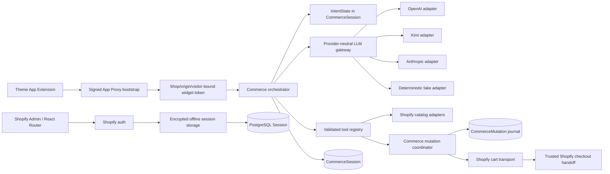

# Intent card Shopify - Post-run runtime audit

> Historical snapshot: this audit predates the CommerceProvider/UCP,
> ExperienceDocument, experiment, recovery, and persistent merchant-settings
> work. Use `docs/execution/PRODUCTION_RUN.md` as the current execution record.

Current validation addendum: the extended run subsequently passed all 113
tests against disposable PostgreSQL 16, applied all 11 migrations, executed
the 3 candidate rollbacks, and smoke-tested the built runtime. The Railway
service is healthy but still lacks the candidate UCP profile.

Audit delta recorded on 2026-08-01 after the local stabilization run. The
pre-run evidence remains in `docs/audits/LAB_AUDIT.md` and
`docs/runs/PRE_RUN_BASELINE.md`.

## 1. Carte d'identité

| Champ          | État post-run                                                | Preuve                                     |
| -------------- | ------------------------------------------------------------ | ------------------------------------------ |
| Produit        | IntentCart, runtime Shopify de Sage                          | Code et configuration locale               |
| Dépôt          | `shop-chat-agent`                                            | Git local                                  |
| Branche        | `codex/intentcart-admin-freeze`                              | Git local                                  |
| HEAD de départ | `43ae66e4c5b9de4f3bbc74a043701d784febdb8d`                   | Git local                                  |
| Maturité       | Release candidate locale, non déployable sans gates externes | Tests locaux et limites listées ci-dessous |
| Principe       | Sage recommande, Shopify transacte                           | Contrats et garde-fous runtime             |

## 2. Résumé exécutif

Le runtime possède maintenant une stratégie locale testée pour les access
tokens offline expirants, une origine canonique stable, quatre adaptateurs LLM
sous un contrat commun, une frontière UCP et une barrière persistante contre
les doubles effets commerce. Un E2E déterministe couvre le chemin installation
jusqu'au handoff checkout.

Cette amélioration n'est pas en production. Les trois migrations et leurs
rollbacks ont été validés sur PostgreSQL local jetable, mais n'ont été appliqués
à aucune base distante. Le dev-store n'a pas été muté et aucun provider payant
n'a été appelé. Railway répond sur les deux healthchecks mais renvoie 404 pour
le profil UCP candidat. La qualification correcte est donc **Working with
limitations, locally stabilized**.

## 3. Je suis / je fais / je peux

> Je suis IntentCart, la frontière Shopify native du runtime Sage.
>
> J'ai été créé pour transformer une intention en découverte, comparaison,
> confirmation, panier et checkout sans dupliquer la vérité Shopify.
>
> Je sais maintenant chiffrer et renouveler une session offline avec contrôle
> de concurrence, sélectionner plusieurs providers LLM derrière un même port,
> bloquer le fallback après le début d'une mutation, et prouver le parcours en
> mode déterministe.
>
> Je ne sais pas encore prouver ces comportements sur une base preview, une
> installation dev-store et le déploiement Railway courant.
>
> Mon actif principal est le runtime multitenant Shopify et sa frontière
> anti-double-effet.

## 4. Architecture post-run observée

## 5. Fonctionnalités et maturité

| Fonctionnalité                  | Statut                   | Testée                      | Déployée post-run | Limite                                              |
| ------------------------------- | ------------------------ | --------------------------- | ----------------- | --------------------------------------------------- |
| Session offline chiffrée        | Working with limitations | Oui, 9 tests                | Non               | Migration distante et refresh dev-store non prouvés |
| Rotation offline concurrente    | Working with limitations | Oui                         | Non               | PostgreSQL local prouvé, dev-store non prouvé       |
| Résolution URL canonique        | Working                  | Oui, 5 tests                | Non               | Configuration Shopify distante inchangée            |
| OpenAI adapter                  | Working with limitations | Contrat mocké               | Non               | Aucun appel live                                    |
| Kimi adapter                    | Working with limitations | Contrat mocké               | Non               | Aucun appel live                                    |
| Anthropic adapter               | Working with limitations | Contrat mocké               | Non               | Config locale résolue, disponibilité non testée     |
| Fake provider                   | Working                  | Oui                         | Non requis        | Réservé aux tests                                   |
| Fallback pré-mutation           | Working                  | Oui                         | Non               | Déploiement absent                                  |
| Blocage fallback post-mutation  | Working                  | Oui                         | Non               | Déploiement absent                                  |
| Journal d'idempotence           | Working with limitations | Tests mémoire et PostgreSQL | Non               | Migration non appliquée en preview/production       |
| Confirmation exacte             | Working                  | Oui                         | Non nouveau       | Dev-store non revalidé                              |
| E2E shopper-to-checkout fixture | Working                  | Oui                         | Non               | Shopify simulé uniquement aux frontières            |
| E2E dev-store                   | Unknown                  | Non                         | Non               | Autorité distante non supposée                      |
| Dashboard marchand éditable     | Working with limitations | Oui                         | Non               | Cinq pages persistées; iframe live non validée      |

## 6. Contrats stabilisés

| Contrat                | Version                 | Validation                         | Rôle                                                               |
| ---------------------- | ----------------------- | ---------------------------------- | ------------------------------------------------------------------ |
| `IntentState`          | `1.0`                   | Zod strict + tests                 | État d'intention versionné, future composante de `CommerceSession` |
| `CatalogSearchRequest` | `1.0`                   | Zod strict + tests                 | Port d'entrée intent-to-catalog, limite de trois produits          |
| `PurchaseCandidate`    | `1.0`                   | Zod strict + tests                 | Produit, variante, quantité et confirmation exacts                 |
| `CartSnapshot`         | `1.0`                   | Zod strict + tests                 | Projection canonique du panier Shopify                             |
| `LLMProviderAdapter`   | Runtime                 | Assertions + 19 tests contractuels | `execute`, `stream`, capacités et erreurs normalisées              |
| `CommerceMutation`     | Schéma Prisma + service | 9 tests                            | Journal de l'effet commerce et idempotence                         |

## 7. Données et sécurité

| Donnée             | Source de vérité  | Stockage                               | Protection                                               |
| ------------------ | ----------------- | -------------------------------------- | -------------------------------------------------------- |
| Tokens Shopify     | Shopify           | `Session` PostgreSQL                   | Chiffrement applicatif, lease, version, révocation       |
| Intent et parcours | Sage runtime      | `CommerceSession`                      | Tenant shop, validation et version optimiste existantes  |
| Produit/prix/stock | Shopify           | Projection de session bornée           | Shopify reste autoritatif                                |
| Confirmation       | Shopper + session | Pending message puis journal           | UUID, révision et hash de requête                        |
| Mutation panier    | Shopify           | `CommerceMutation` + `CommerceSession` | Idempotency key opaque, résultat nettoyé, état `unknown` |
| Prompts LLM        | Marchand/runtime  | Mémoire de requête                     | Pas de journalisation complète ajoutée                   |

## 8. Intégrations

| Intégration              | Statut post-run          | Preuve                                     | Risque restant                 |
| ------------------------ | ------------------------ | ------------------------------------------ | ------------------------------ |
| Shopify Admin/App Proxy  | Implemented but blocked  | Code et tests locaux                       | Config installée non réalignée |
| Shopify session refresh  | Implemented but blocked  | Service et tests                           | Migration/dev-store            |
| Shopify catalog/cart/MCP | Working with limitations | Tests existants + E2E fixture              | Connectivité live non retestée |
| OpenAI                   | Prepared only            | Adapter et tests                           | Clé/live smoke non prouvés     |
| Kimi/Moonshot            | Prepared only            | Adapter et tests                           | Clé/live smoke non prouvés     |
| Anthropic                | Implemented but blocked  | Adapter, config check                      | Aucun live smoke post-run      |
| PostgreSQL/Supabase      | Implemented but blocked  | 11 migrations, 8 tests, 3 rollbacks locaux | Aucune migration distante      |
| Railway                  | Verified infrastructure  | Health et DB 200, profil UCP 404           | Révision candidate absente     |
| UCP                      | Working with limitations | Client/provider et 13 tests                | Aucun service live validé      |
| Hydrogen                 | Documented only          | Handoff                                    | Aucune surface runtime         |

## 9. Tests et preuves

Exécutés localement le 2026-08-01 :

- `npm test`: 113 passés, aucun test ignoré, avec PostgreSQL 16 jetable.
- `npm run test:e2e:deterministic`: 1 passé.
- `npm run typecheck`: passé.
- `npm run lint`: passé.
- `npm run build`: passé, 344 modules client et 87 modules SSR, avec
  avertissements React Router non bloquants.
- Prisma generate et validation sûre: passés.
- Les 11 migrations et les 3 rollbacks candidats: passés localement.
- Smoke du build: `/health`, `/health/db` et `/ucp/agent-profile` en HTTP 200.
- `npm run llm:check-config`: passé sans appel réseau.
- `npm run format:check`: 49 fichiers historiques ou non liés restent hors
  format; les fichiers du run passent le contrôle ciblé.

Non prouvés : migration preview/production, refresh token Shopify réel,
provider LLM live, installation dev-store, panier Shopify réel et production
candidate.

## 10. Documentation versus réalité

| Affirmation                                 | Code observé         | Preuve                     | Verdict                          |
| ------------------------------------------- | -------------------- | -------------------------- | -------------------------------- |
| Les tokens offline expirants sont supportés | Oui localement       | 7 tests                    | Corrigé localement, non déployé  |
| Plusieurs LLM sont interchangeables         | Oui au port/adapters | 16 tests                   | Corrigé localement, live inconnu |
| Le fallback ne double pas une mutation      | Oui                  | Tests avant/après start    | Prouvé localement                |
| Le checkout complet fonctionne              | Fixture seulement    | E2E déterministe           | Dev-store et production inconnus |
| La production est stabilisée                | Non                  | Aucun déploiement post-run | Faux à ce stade                  |
| Le dashboard est éditable sur cinq surfaces | Oui localement       | Routes et persistance      | Non déployé                      |

## 11. Actifs récupérables

| Actif                      | Décision         | Destination                                        |
| -------------------------- | ---------------- | -------------------------------------------------- |
| URL resolver               | PROMOTE AS-IS    | Sage Shopify runtime                               |
| Provider contract/registry | PROMOTE AS-IS    | Sage Core runtime                                  |
| Mutation coordinator       | PROMOTE AS-IS    | Commerce safety layer                              |
| Offline session storage    | ADAPT            | Shopify auth/session layer après preuve PostgreSQL |
| `IntentState`              | EXTRACT CONTRACT | `CommerceSession.intent`                           |
| `CatalogSearchRequest`     | EXTRACT CONTRACT | Catalog provider port                              |
| `PurchaseCandidate`        | PROMOTE AS-IS    | Toute mutation commerce                            |
| `CartSnapshot`             | EXTRACT CONTRACT | Provider-neutral commerce state                    |
| Deterministic E2E          | PROMOTE AS-IS    | CI locale                                          |
| Dashboard actuel           | PROMOTE AS-IS    | Admin IntentCart après preuve preview              |

## 12. Risques

1. **P0 — bloquant:** migrations prouvées localement mais non appliquées et non
   restaurées sur une preview approuvée.
2. **P0 — bloquant:** aucune validation dev-store de la rotation offline et du
   panier idempotent.
3. **P0 — bloquant:** aucun provider live validé après le nouveau registre.
4. **P1 — important:** l'origine Shopify installée doit être réalignée après un
   déploiement stable.
5. **P1 — important:** une seule réplique et aucun mécanisme externe de
   réconciliation/alerte des mutations `unknown`.
6. **P2 — amélioration:** backlog de formatage et avertissements React Router.

## 13. Recommandation

Décision: **ADAPT AND VERIFY**. Conserver cette branche comme candidate locale,
faire d'abord une preview avec PostgreSQL isolé, puis exécuter le dev-store E2E.
Ne pas fusionner de lab, ne pas activer de fallback LLM en production, et ne pas
qualifier la version de production tant que les trois P0 externes ne sont pas
fermés.

Le handoff d'extension est défini dans `docs/runs/RECOVERY_HANDOFF.md` et les
gates de déploiement dans `docs/runbooks/DEPLOYMENT_READINESS.md`.
