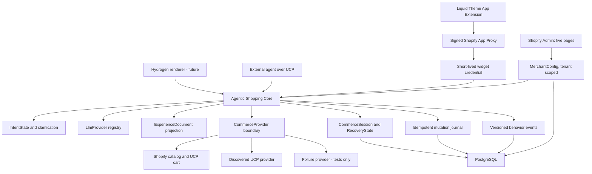

# IntentCart production stabilization run

Date: 2026-08-01

## Executive decision

IntentCart is now a locally executable Shopify runtime release candidate. It
is not yet a production release. The security boundaries, commerce providers,
versioned core contracts, merchant persistence, experimentation, recovery, and
five-page admin configuration are implemented and covered by local tests.

The currently deployed Railway service is live at the infrastructure level:
`GET /health` and `GET /health/db` both returned HTTP 200 on 2026-08-01. It is
not running this candidate: `GET /ucp/agent-profile` returned HTTP 404. No
deployment, remote migration, Shopify mutation, paid LLM request, commit, or
push was performed in this run.

Product principle: **Sage recommends. Shopify transacts.**

## Identity and source state

| Field                 | Observed value                                                                   |
| --------------------- | -------------------------------------------------------------------------------- |
| Repository            | `shop-chat-agent`                                                                |
| Local repository root | `.`                                                                              |
| Branch                | `codex/intentcart-admin-freeze`                                                  |
| HEAD                  | `43ae66e4c5b9de4f3bbc74a043701d784febdb8d`                                       |
| Remote                | `https://github.com/0xplug75/shop-chat-agent.git`                                |
| Worktree              | Dirty by design; stabilization changes plus preserved user documentation changes |
| Deployment action     | None                                                                             |

Pre-existing user changes in `docs/PROJECT_STATE.md`, `docs/Vision.md`, and
`docs/Positioning.md` were preserved.

## Admin navigation invariant

The embedded Shopify Admin navigation remains exactly:

1. Home
2. Assistant
3. Widget
4. Knowledge
5. Commerce

No primary page was added. Runtime complexity is configured or summarized
behind these five surfaces.

## Runtime architecture



## Implemented boundaries

### Shopify production security

- Expiring offline sessions support encrypted access and refresh tokens.
- Refresh ownership uses a database lease and optimistic token version.
- Definitive refresh failure invalidates the session; transient failure does
  not discard a potentially valid token pair.
- Uninstall handling marks the shop uninstalled and removes admin sessions.
- App Proxy authentication is delegated to Shopify's signed request verifier.
- Widget credential version 2 is short-lived and bound to the shop, storefront
  origin, and anonymous visitor. Direct calls use a bearer credential; signed
  App Proxy POSTs carry it in the JSON body because Shopify does not preserve
  arbitrary browser headers through the proxy.
- App Proxy credentials are checked against the signed tenant context. The
  credential is never placed in a query string, and conversation reads and
  writes are scoped by both shop and visitor.
- Widget rate limiting is stored in PostgreSQL outside test mode, enforced at
  visitor, trusted-network-when-available, shop, and bootstrap layers, and
  fails closed when the shared store is unavailable.
- Logs are structured and carry request, shop, conversation, and commerce
  correlation identifiers where available.

### Shopper commerce path

The implemented path is:

```text
intent capture
-> clarification
-> catalog search
-> maximum three recommendations
-> explanation and comparison
-> product and variant selection
-> explicit product/variant/quantity confirmation
-> one idempotent Shopify cart mutation
-> Shopify checkout handoff
-> versioned outcome event
```

`update_cart` cannot call a provider unless the pending confirmation ID,
selection revision, product, variant, and quantity match the shopper's explicit
confirmation. A retry cannot switch LLM provider after a commerce side effect
has started. An ambiguous provider timeout becomes `side_effect_unknown`.

### UCP

`CommerceProvider` has three implementations:

- `ShopifyProvider`: Shopify catalog/policy reads plus discovered UCP cart.
- `UcpProvider`: discovered catalog, cart, and optional checkout operations.
- `FixtureProvider`: rejected outside `NODE_ENV=test`.

The UCP client reads `/.well-known/ucp`, selects the advertised
`dev.ucp.shopping` MCP service, calls `tools/list`, and validates each outgoing
payload and provider response against the advertised JSON Schemas. Unsupported
operations fail closed. Continuation URLs are validated, and messages,
warnings, disclosures, and escalation state are retained. Checkout completion
remains hard-disabled.

### LLM providers

The shared port supports OpenAI, Kimi/Moonshot, Anthropic, and a deterministic
test provider. The merchant-facing selector intentionally exposes only Auto,
OpenAI, and Kimi. Providers share normalized messages, tools, structured
output, streaming, usage, timeout, abort, cost, and error behavior.

Anthropic is a compatibility adapter, not an approved provider for this
release. The local offline configuration check selected it only because a
legacy local variable exists. Preview and production must explicitly set
`AI_PROVIDER` to `openai` or `kimi` and leave Anthropic variables unset.

Retries are bounded. Fallback is allowed only before text has streamed and
before a commerce side effect starts. No live provider completion was sent in
this run.

### Contracts and rendering

The canonical strict Zod contract module is
`app/contracts/commerce.schemas.server.js`. It includes:

- `MerchantContext`
- `BuyerContext`
- `IntentState`
- `VerticalPack`
- `CatalogSearchInput` and `CatalogSearchRequest`
- `NormalizedProduct` and `ProductTrust`
- `RecommendationSet`
- `CartCandidate` / compatibility alias `PurchaseCandidate`
- `CartSnapshot`
- `CommerceSession`
- `ExperienceDocument`
- `ExperimentAssignment`
- `BehaviorSignal`
- `RecoveryState`

The runtime now creates an `ExperienceDocument` after each completed turn,
persists it with the assistant message, and emits it over SSE. The existing
widget still renders the legacy product events, so this addition does not
redesign the storefront.

No skincare-specific identifier or rule remains in `app/`, `prisma/`, or the
Theme App Extension. `VerticalPack` stays generic; skincare appears only as a
schema-test example for a future external pack.

### Merchant configuration

All five admin pages use the authenticated tenant context and persist the full
configuration in `MerchantConfig.settings` with optimistic version checks.
Legacy columns remain populated for rolling compatibility.

- Home: launch state, real integration health, session and checkout metrics.
- Assistant: name, personality, voice, welcome, prompts, logical LLM choice.
- Widget: layout, entry behavior, frequency, Theme Editor handoff, flags.
- Knowledge: Shopify catalog, policies, approved documents, vertical IDs,
  provenance and source status.
- Commerce: recommendation cap, stock behavior, mandatory confirmation,
  provider, checkout strategy, UCP, recovery, and experiments.

### Experimentation and recovery

- Launcher assignment is deterministic per shop, visitor, and experiment.
- Control is `reactive`; treatment is `contextual`.
- Treatment respects the merchant's maximum proactive frequency using
  session-scoped browser storage.
- Exposure is accepted only through the signed App Proxy, checked against the
  server assignment, and recorded atomically once.
- Kill switch and per-shop flags are persisted.
- Recovery stores intent, up to three recommendations, the exact cart
  candidate, cart ID, checkout URL, timestamps, and status.
- Recovery is permitted only for the same visitor in the same shop and before
  expiry; no external solicitation is implemented.

## Migrations prepared

| Migration                                         | Purpose                                                                                    | Rollback                                                    |
| ------------------------------------------------- | ------------------------------------------------------------------------------------------ | ----------------------------------------------------------- |
| `20260801090000_secure_expiring_offline_sessions` | Token encryption/rotation metadata and refresh lease                                       | Manual rollback included; requires reauthorization planning |
| `20260801100000_commerce_mutation_journal`        | Durable idempotency and side-effect states                                                 | Manual rollback included; reconcile unknown mutations first |
| `20260801120000_agentic_shopping_core`            | Full config, provider cost, experiments, recovery, event attribution, shared rate limiting | Manual rollback included; export operational data first     |

All eleven repository migrations, including the three above, were applied in
order to a disposable local PostgreSQL 16 container. The three manual rollback
files were then executed successfully in strict reverse order. The container
was stopped and removed. No migration was applied to Supabase or another
remote database.

## Verification evidence

| Check                        | Result                   | Evidence or limitation                                                                   |
| ---------------------------- | ------------------------ | ---------------------------------------------------------------------------------------- |
| Full Vitest suite            | PASS                     | 113 tests passed in 16 files with PostgreSQL integration enabled                         |
| PostgreSQL integration suite | PASS                     | 8 tests passed against disposable PostgreSQL 16 on `127.0.0.1`                           |
| Migration deployment         | PASS LOCAL               | All 11 migrations applied in order; no remote database used                              |
| Manual rollback validation   | PASS LOCAL               | All 3 candidate rollback files executed in reverse order                                 |
| Deterministic commercial E2E | PASS                     | Installation session through checkout handoff; all external boundaries deterministic     |
| Lint                         | PASS                     | ESLint completed without errors                                                          |
| Typecheck                    | PASS                     | React Router type generation and TypeScript completed                                    |
| Production build             | PASS                     | 344 client and 87 SSR modules transformed                                                |
| Local built-runtime smoke    | PASS                     | `/health`, `/health/db`, and `/ucp/agent-profile` returned HTTP 200                      |
| Prisma generate              | PASS                     | Prisma Client 6.19.3 generated                                                           |
| Prisma validate              | PASS                     | Placeholder local URLs; no database connection                                           |
| LLM config check             | PASS offline             | Configuration resolved; no provider network call                                         |
| Format check                 | KNOWN BACKLOG            | 49 historical or unrelated files remain unformatted; run-owned files pass targeted check |
| npm production audit         | RISK ACCEPTANCE REQUIRED | One React Router RSC advisory affects four dependency entries; no RSC mode is present    |
| GitHub Actions CI            | PREPARED, NOT EXECUTED   | PostgreSQL 16 workflow requires migrations, 113 tests, lint, typecheck, and build        |

The React Router advisory is not treated as fixed. React Router 8.3 is outside
the currently installed Shopify React Router adapter's supported peer range.
The app does not enable RSC mode, which limits current exposure, but dependency
alignment remains a release gate to reassess.

## Deployment status

| Environment                       | Status                                | Proof                                                                |
| --------------------------------- | ------------------------------------- | -------------------------------------------------------------------- |
| Local                             | Verified runtime and PostgreSQL tests | 113 tests, migrations, rollbacks, build, and local endpoint smoke    |
| Preview                           | Unknown                               | No distinct preview service/database verified                        |
| Railway production infrastructure | Verified live                         | `/health` 200 and `/health/db` 200 on 2026-08-01                     |
| This candidate in production      | Not deployed                          | Deployed `/ucp/agent-profile` returned 404                           |
| Shopify dev-store E2E             | Not run                               | No remote cart authority was assumed                                 |
| Two-shop E2E                      | Blocked                               | No second authorized development store/session available to this run |

## Feature-state summary

The canonical detail is in `docs/execution/FEATURE_MATRIX.md`.

- Local working: strict contracts, provider registries, token storage,
  shop-and-visitor scoping, layered rate limiting, confirmation barrier,
  deterministic E2E, admin saves, recovery logic, experiment assignment,
  PostgreSQL migrations/rollbacks, and built-runtime health endpoints.
- Behind flags: UCP cart, UCP checkout handoff, session recovery, contextual
  launcher, launcher experiment.
- Simulated: CI catalog/cart/checkout provider and deterministic LLM.
- Externally blocked: remote migrations, live LLM smoke test, dev-store cart,
  two-store isolation proof, deployment of this candidate, backup/restore,
  first CI run, alert delivery, and Shopify App Review.

## Operational blockers

1. Back up an approved preview database, apply all three migrations there, and
   repeat the eight PostgreSQL integration tests. Local PostgreSQL proof is
   complete; preview data and platform behavior are not.
2. Repair the local Shopify CLI installation; its executable points to a
   missing `/opt/homebrew/opt/node/bin/node`.
3. Configure and smoke-test OpenAI or Kimi without commerce tools before
   enabling provider fallback in production.
4. Deploy an immutable commit to preview and verify the UCP profile, App Proxy,
   widget bootstrap, logs, and database readiness.
5. Run the exact cart and checkout journey on two authorized development
   stores, including reinstall and duplicate-confirmation cases.
6. Configure external monitoring and alerts for health, database readiness,
   LLM failures, and `side_effect_unknown` mutations.
7. Capture backup and restore evidence before any production migration.

## Documents

- Feature matrix: `docs/execution/FEATURE_MATRIX.md`
- Environment variables: `docs/execution/ENVIRONMENT_VARIABLES.md`
- Deployment and rollback: `docs/runbooks/PRODUCTION_DEPLOYMENT.md`
- Shopify App Review: `docs/runbooks/SHOPIFY_APP_REVIEW.md`
- Screencast: `docs/runbooks/SCREENCAST_CHECKLIST.md`
- Dev-store E2E: `docs/runbooks/SHOPIFY_E2E.md`
- Promotion manifest: `PROMOTION_MANIFEST.json`

## Final release decision

**Do not label or deploy this worktree as production.** First turn it into an
immutable reviewed commit, migrate an isolated preview database, pass the
PostgreSQL suite and two-store dev E2E, validate one live LLM provider, then
deploy and verify the exact revision. The current code is a strong release
candidate; the remaining P0s are external proof and operations, not hidden
claims of completion.
