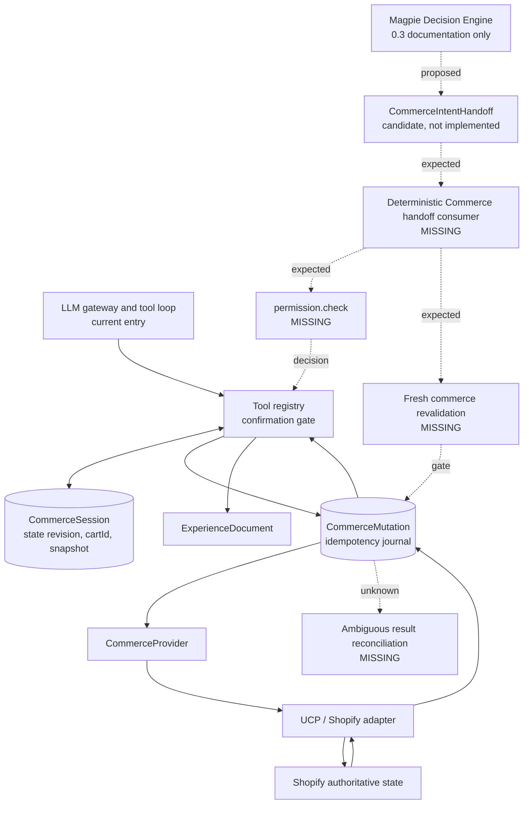

# Sage Decision Logic 0.3 - Revue de la frontière Shopify Commerce

| Champ | Valeur |
|---|---|
| Reviewer | IntentCart Shopify |
| Lab | `Intent Card_SHOPIFY` |
| Dépôt réel | `shop-chat-agent-work` |
| Branche observée | `codex/intentcart-admin-freeze` |
| Commit observé | `ff99924c26bb1da08c43451852fee1c618dddfc6` |
| Draft revu | `0.3.0-catalog-resolved` |
| Date | 2026-08-08 |
| Nature | Revue architecturale en lecture seule |
| Approbation conditionnelle | Oui |
| Frontière Commerce gelable | Non |

## 1. Résumé exécutif

La direction du draft est correcte : Magpie s'arrête à une intention commerce
structurée, puis le runtime Shopify possède la résolution de variante et de
quantité, les permissions, la confirmation, la revalidation, l'idempotence, la
mutation et le résultat autoritatif. Le draft ne déplace ni panier, ni prix, ni
stock dans Sage.

Le runtime IntentCart observé fournit déjà trois fondations utiles : une session
Commerce isolée par boutique et révisée de façon optimiste, une confirmation
explicite sur produit/variante/quantité, et un journal de mutation qui bloque les
replays et les retries après résultat ambigu. Les 67 tests Commerce ciblés et
les 105 tests non-PostgreSQL de la suite complète passent.

La frontière ne peut toutefois pas être gelée. Il manque encore un port
`permission.check`, une confirmation bornée dans le temps et liée à un snapshot
commerce, une revalidation fraîche de la variante, du prix, du stock et du
panier juste avant mutation, une réconciliation des résultats ambigus, et une
union de résultat autoritatif. De plus, la clé d'idempotence créée par le journal
n'est pas transmise aux appels UCP `create_cart` et `update_cart`, et la création
de checkout contourne le coordinateur de mutation.

Enfin, le runtime actuel laisse le LLM demander directement `update_cart` et
`create_checkout_handoff`. Les garde-fous déterministes réduisent le risque,
mais cette topologie contredit la section 23, qui rejette un agent libre comme
exécuteur du core. Le futur consommateur de `CommerceIntentHandoff` doit être un
orchestrateur Commerce déterministe; le LLM peut interpréter et formuler, mais
ne doit pas décider qu'une mutation est exécutable.

Verdicts : **3 KEEP, 7 MODIFY, 1 REJECT, 5 MISSING**. Onze items sont bloquants
avant freeze. L'architecture reçoit une approbation conditionnelle, pas une
autorisation de freeze.

### Niveau de preuve

- **Preuve observée** : code, schéma ou test présent dans ce dépôt et inspecté.
- **Documentation** : affirmation des sources Magpie ou des documents locaux.
- **Inférence** : conclusion tirée des preuves observées, explicitement signalée.
- **Inconnu** : comportement non prouvé localement, notamment les services live.

## 2. Périmètre réellement inspecté

### Sources Magpie lues sans modification

| Source | Rôle | État retenu |
|---|---|---|
| `../labs/magpie-intent-finder/docs/decision-logic/SAGE_DECISION_LOGIC_V1_DRAFT.md` | Draft complet, sections 01, 07, 18, 19 et 23 à 28 | Source reviewée |
| `../labs/magpie-intent-finder/docs/decision-logic/SAGE_DECISION_LOGIC_V1_REVIEW_PROTOCOL.md` | Questions Shopify, format et critères de freeze | Protocole 1.1 |
| `../labs/magpie-intent-finder/docs/decision-logic/reviews/CATALOG_KIT_RESOLUTION_LOG.md` | Ownership catalogue déjà résolu | Appliqué à 0.3; non réouvert |
| `../labs/magpie-intent-finder/docs/decision-logic/SAGE_DECISION_LOGIC_V0_3_CHANGE_PROPOSAL.md` | Delta 0.2 vers 0.3 | Documentation et contrats indicatifs |
| `../labs/magpie-intent-finder/docs/agent-system/LAB_MINI_ME.json` | Limites de Magpie | Confirme `commerce_mutations: false` |

Le protocole impose que Shopify challenge les permissions, confirmations,
mutations et l'état Commerce sans réinventer l'intention ou le ranking
(`SAGE_DECISION_LOGIC_V1_REVIEW_PROTOCOL.md:92-122`). Le journal Catalog Kit
maintient trois gates catalogue ouvertes, mais aucune n'est réattribuée ici
(`CATALOG_KIT_RESOLUTION_LOG.md:138-161`).

### Runtime Shopify inspecté

- Contrats Zod : `app/contracts/commerce.schemas.server.js`.
- Orchestration et confirmation : `app/services/commerce-orchestrator.server.js`.
- Registre d'outils et mutations panier : `app/services/tool-registry.server.js`.
- Session Commerce : `app/services/commerce-session.server.js`.
- Journal et idempotence : `app/services/commerce-mutation.server.js`.
- Providers et client UCP : `app/services/commerce/ucp-provider.server.js`,
  `app/services/commerce/ucp-client.server.js`.
- Gateway LLM : `app/services/llm-gateway.server.js`.
- Projection Experience : `app/services/experience-document.server.js`.
- Événements : `app/services/analytics-event.server.js`.
- Persistance : `prisma/schema.prisma`.
- Tests Commerce, UCP, session, LLM et Experience sous `tests/`.

Le worktree contenait déjà des modifications et fichiers non suivis attribués à
l'utilisateur. Ils n'ont pas été touchés. Aucun appel Shopify, UCP, Supabase ou
Railway live n'a été exécuté. Aucune mutation, migration ou écriture distante
n'a été tentée.

## 3. Architecture Commerce observée



La ligne pleine montre le chemin actuellement implémenté. La ligne pointillée
montre les contrats ou services requis par le draft mais absents du runtime.

### Ownership réel observé

| Sujet | Owner attendu | Preuve observée | Verdict factuel |
|---|---|---|---|
| Panier | Commerce Runtime + Shopify | `CommerceSession.cartId` et snapshot dans `buyerContext`; provider pour lecture/écriture (`prisma/schema.prisma:242-279`, `tool-registry.server.js:406-435`) | Le runtime garde une référence; Shopify reste autoritatif |
| `cartVersion` | Commerce Runtime, issu du provider | Aucun champ ou contrat `cartVersion`; `CommerceSession.version` est une révision de session (`commerce-session.server.js:239-276`) | **Absent**; ne pas confondre les deux versions |
| Variante et quantité | Commerce Runtime | `PurchaseCandidateSchema` et confirmation exacte (`commerce.schemas.server.js:357-368`, `tool-registry.server.js:316-370`) | Owner correct, validation fraîche incomplète |
| Permission | Commerce Runtime | Pas de service ni union `permission.check`; seulement auth tenant, capabilities provider et confirmation | **Absent comme responsabilité explicite** |
| Confirmation | Commerce Runtime | Résolution du dernier message pending et comparaison produit/variante/quantité (`commerce-orchestrator.server.js:479-508`, `tool-registry.server.js:530-550`) | Présente, sans expiration ni snapshot commerce |
| Idempotence | Commerce Runtime | Réservation persistante et unicité par boutique (`commerce-mutation.server.js:83-249`, `prisma/schema.prisma:281-305`) | Solide localement, propagation provider partielle |
| Revalidation prix/stock | Commerce Runtime + Shopify | L'outil relit seulement `session.recommendedProducts` et `variant.available` (`tool-registry.server.js:288-307`) | **Pas de revalidation live juste avant mutation** |
| Résultat autoritatif | Commerce Runtime + Shopify | Résultat provider journalé avant retour (`commerce-mutation.server.js:205-248`) | Base présente, union et réconciliation absentes |

### Où Sage s'arrête exactement

Sage s'arrête après avoir produit une sélection décisionnelle encore courante et
une intention d'agir. Il peut fournir un produit opaque, des préférences
d'options et des références de preuve, mais pas un `variantId`, une quantité,
un prix, un stock, un panier, une permission, une confirmation ou un succès
autoritatifs. Le runtime Commerce prend alors la main. Sage peut ingérer ensuite
un événement de résultat pour mettre à jour son état, mais le message de succès
shopper doit être projeté depuis le résultat typé du runtime, sans
réinterprétation probabiliste.

## 4. Crosswalk avec `CommerceIntentHandoff`

| Champ 0.3 | Verdict | Analyse Shopify |
|---|---|---|
| `kind`, `version` | MODIFY | Conserver le discriminant, passer à `1.1` après modification du contrat |
| `handoffId` | KEEP | Référence stable du handoff, unique et opaque |
| `decisionId` | KEEP | Relie l'intention à la décision sans transcript |
| `stateRevision` | KEEP | Permet de refuser une décision devenue stale; ce n'est pas `cartVersion` |
| `selectedProductRef` | MODIFY | Garder une référence opaque structurée, jamais un objet catalogue complet |
| `selectedOptionPreferences` | KEEP | Préférences seulement; elles ne prouvent ni variante ni disponibilité |
| `shopperActionIntent` | MODIFY | `buy_candidate` est ambigu et peut être lu comme ordre de transaction |
| `marketRef` | KEEP | Contexte opaque acceptable, à résoudre et revalider par le runtime |
| `evidenceSnapshotRefs` | KEEP | Références seulement, aucune donnée commerce supposée actuelle |
| `unresolvedCommerceInputs` | KEEP | Rend explicites variante, quantité et disponibilité non résolues |
| `issuedAt`, `expiresAt` | MISSING | Nécessaires pour rejeter un handoff trop ancien |
| `correlationId`, `causationId` | MISSING | Nécessaires pour lier décision, confirmation, mutation, événement et résultat |

Le contrat candidat est sérialisable et ne contient aucun champ PII ou secret
évident. Il ne possède toutefois ni invariant explicite `containsPII: false`, ni
limites de taille, ni validation runtime dans IntentCart. Sa sémantique actuelle
reste une intention, sauf `buy_candidate`, qui la rapproche dangereusement
d'une commande de mutation.

### Forme TypeScript indicative minimale

```ts
interface CommerceIntentHandoff {
  kind: "CommerceIntentHandoff";
  version: "1.1";
  handoffId: string;
  decisionId: string;
  stateRevision: number;
  correlationId: string;
  causationId?: string;
  issuedAt: string;
  expiresAt: string;
  selectedProductRef: {
    namespace: string;
    id: string;
  };
  selectedOptionPreferences: Array<{
    optionName: string;
    preferredValue: string;
  }>;
  shopperActionIntent:
    | "check_availability"
    | "prepare_cart_candidate"
    | "request_cart_add"
    | "request_checkout_handoff";
  marketRef: string;
  evidenceSnapshotRefs: string[];
  unresolvedCommerceInputs: Array<"variant" | "quantity" | "availability">;
  containsPII: false;
  containsSecret: false;
}
```

Owner : **Magpie pour la production du handoff; Commerce Runtime pour sa
validation et son traitement**.

Invariants :

1. `expiresAt` est strictement postérieur à `issuedAt` et le runtime applique
   une durée maximale configurée.
2. `stateRevision` doit être la révision décisionnelle encore courante.
3. Aucun `variantId`, quantité, prix, stock, `cartId`, `cartVersion`, permission,
   confirmation ou résultat n'est transporté comme vérité finale.
4. `request_cart_add` et `request_checkout_handoff` expriment une demande; ils
   n'autorisent aucune mutation par eux-mêmes.
5. Les tableaux et chaînes sont bornés; aucune PII, clé, token, URL signée ou
   payload provider brut n'est accepté.

## 5. Matrice permissions et confirmations

| Action | Permission | Confirmation | Revalidation | Exécution | Résultat |
|---|---|---|---|---|---|
| `check_availability` | Tenant valide, capability de lecture, politique marchande | Non | Produit, marché, variante éventuelle, prix et stock actuels | Lecture provider uniquement | Snapshot autoritatif ou erreur typée |
| `prepare_cart_candidate` | Tenant valide, produit autorisé, capability de résolution | Non; produit une demande de confirmation | Résoudre variante, quantité et affichage prix/stock | Aucune mutation | `confirmation_required` avec reçu expirant |
| `request_cart_add` | `cart.write` autorisé pour boutique, canal et acteur | Oui, exacte et non expirée | Révision Sage, `cartVersion`, variante, quantité, prix et stock immédiatement avant mutation | Journal durable puis provider avec même clé d'idempotence | Succès autoritatif, échec avant mutation ou résultat ambigu |
| `request_checkout_handoff` | Capability checkout/handoff et politique marchande | Requise si l'opération crée ou modifie un checkout; sinon politique explicite | Panier et `cartVersion`, lignes, disponibilité, URL de continuation sûre | Journal si appel side-effecting; simple projection si URL déjà autoritative | Handoff autoritatif, pas achat complété |
| `complete_checkout` | Hors V1 par défaut; permission et capability séparées | Confirmation forte séparée | Checkout courant, montant, marché, identité sécurisée hors Sage | Jamais via le handoff V1 sans contrat dédié | Denied ou résultat autoritatif dédié |

### Où commence `permission.check`

Dans l'architecture cible, un premier contrôle commence après validation du
handoff et du tenant, avant toute préparation d'action. Un second contrôle
déterministe doit être effectué juste avant la réservation de mutation pour
tenir compte d'une politique ou capability modifiée. Dans le code observé, ce
port n'existe pas : l'authentification tenant, la découverte de capability UCP,
la validation d'entrée et la confirmation sont des barrières distinctes, mais
ne constituent pas une décision de permission versionnée.

### Contrats indicatifs internes au runtime

```ts
type CommercePermissionDecision =
  | {
      kind: "allowed";
      action: string;
      policyVersion: string;
      confirmation: "not_required" | "required";
      checkedAt: string;
    }
  | {
      kind: "denied";
      action: string;
      code: string;
      policyVersion: string;
      checkedAt: string;
    };

interface CommerceConfirmationReceipt {
  version: "1.0";
  confirmationId: string;
  handoffId: string;
  action: "request_cart_add" | "request_checkout_handoff";
  stateRevision: number;
  cartRef: string | null;
  cartVersion: string | null;
  candidate: {
    productRef: string;
    variantRef: string;
    quantity: number;
    unitPrice: string;
    currencyCode: string;
  };
  issuedAt: string;
  expiresAt: string;
}
```

Owner : **Commerce Runtime**. La confirmation est valide uniquement pour les
arguments et le snapshot affichés. Toute expiration ou modification de prix,
stock, variante, quantité, panier ou permission l'invalide et impose une
nouvelle confirmation.

## 6. Cycle de revalidation et mutation

### Chemin actuel observé

```text
LLM tool call
-> Zod input
-> variante présente dans le snapshot de session
-> disponibilité du snapshot de session
-> confirmation produit/variante/quantité
-> réservation CommerceMutation
-> appel provider
-> persistance du résultat
-> ExperienceDocument
```

Ce chemin n'effectue pas de lecture live produit/variante entre la confirmation
et la mutation. `PurchaseCandidate.confirmedAt` est créé au moment de
l'exécution, pas au moment où le reçu a été émis, et aucun `expiresAt` n'est
présent (`commerce.schemas.server.js:357-368`,
`tool-registry.server.js:323-370`).

### Cycle requis avant freeze

```text
1. Validate handoff schema, tenant, expiry and stateRevision.
2. permission.check for the requested action.
3. Resolve current product, variant and quantity through CommerceProvider.
4. Read authoritative price, availability and cart snapshot/cartVersion.
5. Render exact candidate and issue an expiring confirmation receipt.
6. Receive an explicit structured acceptance or refusal.
7. Re-check permission and receipt expiry.
8. Re-read variant, price, stock and cartVersion immediately before mutation.
9. If anything changed, invalidate the receipt and request confirmation again.
10. Reserve the durable mutation journal and propagate one idempotency key.
11. Execute exactly once through the selected provider.
12. Persist and return a typed authoritative result.
13. On ambiguity, block retry and reconcile by provider idempotency lookup or
    authoritative cart reread before success, failure or escalation.
```

Le journal actuel couvre correctement les étapes 10 et une partie de 12 : une
mutation `CONFIRMED` est rejouée depuis le journal, tandis que `STARTED` et
`UNKNOWN` bloquent une seconde exécution (`commerce-mutation.server.js:131-202`).
Il ne couvre pas l'étape 13.

## 7. Matrice des résultats et erreurs

| État | Mutation possible ? | Détection et owner | Réponse attendue |
|---|---:|---|---|
| `denied` | Non | `permission.check`, Commerce Runtime | Résultat typé, raison sûre et prochaine action autorisée |
| `confirmation_declined` | Non | Experience transmet un refus structuré | Fermer le reçu pending; ne pas reformuler comme erreur |
| `confirmation_expired` | Non | Horloge Commerce + `expiresAt` | Invalider le reçu et reconstruire un candidat courant |
| `stale_state` | Non | Comparaison `stateRevision` | Refuser le handoff et demander une nouvelle décision Sage |
| `stale_cart` | Non avant mutation | Comparaison `cartVersion`/snapshot provider | Relire le panier et reconfirmer si nécessaire |
| `invalid_variant` | Non | Résolution provider actuelle | Proposer une variante valide sans substitution silencieuse |
| `invalid_quantity` | Non | Schéma + limites provider/marchand | Demander une quantité valide |
| `price_changed` | Non avec ancien reçu | Comparaison du prix confirmé au prix actuel | Montrer le nouveau prix et exiger une nouvelle confirmation |
| `unavailable` | Non | Stock/disponibilité provider actuelle | Expliquer et rendre des alternatives admissibles |
| `failed_before_mutation` | Non, prouvé | Erreur définitive avant acceptation provider | Échec typé; nouveau candidat ou retry contrôlé possible |
| `outcome_unknown` | Peut-être | Timeout/réseau après début de side effect | Aucun retry; réconciliation puis escalade si non résolu |
| `succeeded_authoritative` | Oui, une fois | Résultat Shopify persisté, idéalement relu | Experience peut annoncer le succès exact |

### Union TypeScript indicative

```ts
type CommerceExecutionResult =
  | { status: "denied"; code: string }
  | { status: "confirmation_required"; receipt: CommerceConfirmationReceipt }
  | { status: "confirmation_declined" | "confirmation_expired" }
  | { status: "stale_state"; expectedRevision: number }
  | { status: "stale_cart"; currentCartVersion: string | null }
  | { status: "invalid_variant" | "invalid_quantity"; code: string }
  | { status: "price_changed"; currentUnitPrice: string; currencyCode: string }
  | { status: "unavailable"; code: string }
  | { status: "failed_before_mutation"; code: string }
  | { status: "outcome_unknown"; mutationRef: string; recovery: "reconcile" }
  | {
      status: "succeeded_authoritative";
      mutationRef: string;
      cartRef: string;
      cartVersion: string | null;
      authority: "shopify";
      observedAt: string;
    };

interface CommerceResultEnvelope {
  kind: "CommerceExecutionResult";
  version: "1.0";
  resultId: string;
  handoffId: string;
  correlationId: string;
  occurredAt: string;
  result: CommerceExecutionResult;
  containsPII: false;
  containsSecret: false;
}
```

Owner : **Commerce Runtime**. Magpie peut recevoir une version événementielle
réduite. Experience reçoit uniquement les champs sûrs nécessaires au rendu.

## 8. Items de revue

### SH-01

**SECTION:** 01, 07, 23, 24  
**TARGET:** Constitution et point d'arrêt de Sage  
**VERDICT:** KEEP  
**SEVERITY:** important  
**CLAIM:** Conserver « Sage recommends. Shopify transacts. » et arrêter Magpie à
une intention d'action, avant toute autorité transactionnelle.  
**EVIDENCE:** Le draft exclut variante, quantité, prix, disponibilité, panier,
permission, confirmation et succès (`SAGE_DECISION_LOGIC_V1_DRAFT.md:2291-2340`).
Le Mini-Me déclare `commerce_mutations: false`.  
**PROPOSED_CHANGE:** Aucun.  
**IMPACT_ON_OTHER_SECTIONS:** Fixe l'ownership des sections 23 à 27.  
**TEST_OR_PROOF_REQUIRED:** Test de contrat négatif refusant tout handoff qui
transporte une vérité transactionnelle finale.

### SH-02

**SECTION:** 24  
**TARGET:** `CommerceIntentHandoff` identité, durée et causalité  
**VERDICT:** MODIFY  
**SEVERITY:** blocking  
**CLAIM:** Le contrat minimal manque une expiration et les références de
causalité nécessaires à une exécution sûre et auditable.  
**EVIDENCE:** Le contrat 0.3 contient `handoffId`, `decisionId` et
`stateRevision`, mais pas `issuedAt`, `expiresAt`, `correlationId` ou
`causationId` (`SAGE_DECISION_LOGIC_V1_DRAFT.md:2299-2317`). L'enveloppe
d'événement possède déjà correlation et causation (`:2492-2504`).  
**PROPOSED_CHANGE:** Adopter la forme 1.1 indicative du crosswalk; garder
`cartVersion` hors du handoff Magpie.  
**IMPACT_ON_OTHER_SECTIONS:** 26, 27, 28.  
**TEST_OR_PROOF_REQUIRED:** Validation Zod/JSON, expiration, limites de taille,
PII/secret négatifs et corrélation de bout en bout.

### SH-03

**SECTION:** 07, 24  
**TARGET:** `shopperActionIntent`  
**VERDICT:** MODIFY  
**SEVERITY:** blocking  
**CLAIM:** `buy_candidate` confond intention d'achat, création de checkout et
transaction; `add_candidate` ne dit pas s'il prépare ou mute un panier.  
**EVIDENCE:** L'union actuelle contient `add_candidate`, `buy_candidate` et
`check_availability` (`SAGE_DECISION_LOGIC_V1_DRAFT.md:2310-2316`), alors que le
draft interdit à Sage de garantir une mutation ou un succès (`:2320-2329`).  
**PROPOSED_CHANGE:** Utiliser `check_availability`,
`prepare_cart_candidate`, `request_cart_add` et
`request_checkout_handoff`; exclure `complete_checkout` de V1.  
**IMPACT_ON_OTHER_SECTIONS:** 07, 24, 25, 27, 28.  
**TEST_OR_PROOF_REQUIRED:** Table de conformance action -> opérations autorisées
et test interdisant toute mutation directe depuis un handoff.

### SH-04

**SECTION:** 19, 23, 24  
**TARGET:** Port `permission.check`  
**VERDICT:** MISSING  
**SEVERITY:** blocking  
**CLAIM:** Le draft exige une permission propriétaire, mais IntentCart ne
possède pas de décision de permission versionnée par action.  
**EVIDENCE:** Le draft place permission avant mutation
(`SAGE_DECISION_LOGIC_V1_DRAFT.md:2331-2340`). Le code observé possède auth
tenant, capability UCP et confirmation, mais aucun contrat/service
`permission.check`.  
**PROPOSED_CHANGE:** Ajouter au contrat conceptuel le port
`checkCommercePermission(context, action): CommercePermissionDecision`, owner
Commerce Runtime, sans l'implémenter dans Magpie.  
**IMPACT_ON_OTHER_SECTIONS:** 07, 19, 23, 24, 26, 27, 28.  
**TEST_OR_PROOF_REQUIRED:** Matrice allowed/denied par action, tenant, capability,
feature flag et politique marchande; preuve qu'un denied ne réserve aucune
mutation.

### SH-05

**SECTION:** 24, 27, 28  
**TARGET:** Reçu de confirmation  
**VERDICT:** MISSING  
**SEVERITY:** blocking  
**CLAIM:** La confirmation actuelle n'expire pas et n'est liée ni au prix
affiché, ni au stock, ni au `cartVersion`, ni à la révision courante lors de
l'exécution.  
**EVIDENCE:** Le pending contient `requestedAt` et `selectionRevision`, sans
`expiresAt` (`tool-registry.server.js:323-350`). `confirmationMatches` compare
seulement produit, variante et quantité (`:544-550`).  
**PROPOSED_CHANGE:** Introduire le `CommerceConfirmationReceipt` indicatif,
owner Commerce Runtime, exact, expirant et lié au snapshot revalidé.  
**IMPACT_ON_OTHER_SECTIONS:** 24 à 28.  
**TEST_OR_PROOF_REQUIRED:** Acceptation exacte, refus, expiration, changement de
révision, changement de prix/stock/panier et réutilisation interdite.

### SH-06

**SECTION:** 18, 24, 27  
**TARGET:** Revalidation juste avant mutation  
**VERDICT:** MISSING  
**SEVERITY:** blocking  
**CLAIM:** Le runtime doit relire variante, prix, stock et panier après
confirmation et avant journal/exécution.  
**EVIDENCE:** `update_cart` vérifie la variante et `available` depuis
`session.recommendedProducts` (`tool-registry.server.js:288-307`), puis appelle
directement le coordinateur et le provider (`:361-405`). Aucune lecture produit
fraîche n'est présente.  
**PROPOSED_CHANGE:** Définir un port de revalidation Commerce retournant un
snapshot versionné; toute différence invalide le reçu.  
**IMPACT_ON_OTHER_SECTIONS:** 18, 23, 24, 26, 27, 28.  
**TEST_OR_PROOF_REQUIRED:** Variante supprimée, quantité limitée, prix changé,
stock épuisé, panier concurrent et réponse stale.

### SH-07

**SECTION:** 23, 24, 27  
**TARGET:** Journal de mutation et barrière de retry  
**VERDICT:** KEEP  
**SEVERITY:** important  
**CLAIM:** Conserver l'idempotence persistante et le blocage de tout retry LLM
après le début d'un side effect.  
**EVIDENCE:** Le coordinateur réserve avant exécution, rejoue un résultat
confirmé et bloque `STARTED/UNKNOWN` (`commerce-mutation.server.js:83-249`). Les
unicités sont persistées par boutique (`prisma/schema.prisma:281-305`). Le
gateway bloque fallback et retry (`llm-gateway.server.js:312-323`).  
**PROPOSED_CHANGE:** Aucun sur ce principe.  
**IMPACT_ON_OTHER_SECTIONS:** 23, 24, 27, 28.  
**TEST_OR_PROOF_REQUIRED:** Conserver les tests replay, concurrence, résultat
non persisté et fallback LLM.

### SH-08

**SECTION:** 24, 27  
**TARGET:** Propagation provider de l'idempotence et checkout  
**VERDICT:** MODIFY  
**SEVERITY:** blocking  
**CLAIM:** Une clé locale ne protège pas l'upstream si elle n'est pas transmise;
toute opération checkout side-effecting doit aussi passer par le journal.  
**EVIDENCE:** `addConfirmedItem` reçoit et valide `idempotencyKey`, mais appelle
`create_cart` et `update_cart` sans option d'idempotence
(`ucp-provider.server.js:141-169`), alors que `ucp-client.callTool` sait envoyer
cette option (`ucp-client.server.js:171-195`). `create_checkout_handoff` appelle
`create_checkout` hors coordinateur (`ucp-provider.server.js:172-184`,
`tool-registry.server.js:440-477`).  
**PROPOSED_CHANGE:** Exiger la même clé pour chaque appel mutating et journaliser
la création/update/complete checkout; une lecture ou une URL déjà autoritative
reste sans mutation.  
**IMPACT_ON_OTHER_SECTIONS:** 23, 24, 26, 27, 28.  
**TEST_OR_PROOF_REQUIRED:** Assertion de l'option UCP, replay cross-process et
checkout timeout avant/après acceptation.

### SH-09

**SECTION:** 19, 24, 27  
**TARGET:** Réconciliation des résultats ambigus  
**VERDICT:** MISSING  
**SEVERITY:** blocking  
**CLAIM:** Bloquer le retry est nécessaire mais insuffisant; un owner doit
réconcilier `STARTED/UNKNOWN` avec l'état Shopify avant succès, échec ou
escalade.  
**EVIDENCE:** Toute erreur non classée définitive devient `UNKNOWN` et reste non
retryable (`commerce-mutation.server.js:169-202`). Aucun worker ou méthode de
lookup/reread de mutation n'est présent. Le test dit seulement exposer une
erreur de réconciliation (`commerce-mutation.test.js:187-192`).  
**PROPOSED_CHANGE:** Définir `reconcileCommerceMutation(mutationRef)` utilisant
l'idempotency lookup provider si disponible, sinon un cart reread borné; owner
Commerce Runtime.  
**IMPACT_ON_OTHER_SECTIONS:** 19, 23, 24, 26, 27, 28.  
**TEST_OR_PROOF_REQUIRED:** Timeout sans mutation, timeout avec mutation,
résultat retrouvé, résultat toujours inconnu et escalade après budget épuisé.

### SH-10

**SECTION:** 24, 27  
**TARGET:** Résultat Commerce autoritatif  
**VERDICT:** MISSING  
**SEVERITY:** blocking  
**CLAIM:** `denied`, refus/expiration, stale state/cart, erreurs de sélection,
prix changé, indisponibilité, timeouts et succès doivent former une union
exhaustive possédée par Commerce.  
**EVIDENCE:** Le draft ne définit que `HANDOFF_ERROR`
(`SAGE_DECISION_LOGIC_V1_DRAFT.md:2545-2566`). Le runtime retourne des types
ad hoc (`confirmation_required`, `cart_updated`, `checkout_handoff`) et des
exceptions, sans enveloppe commune.  
**PROPOSED_CHANGE:** Adopter la famille `CommerceResultEnvelope` indicative de
la section 7.  
**IMPACT_ON_OTHER_SECTIONS:** 19, 24 à 28.  
**TEST_OR_PROOF_REQUIRED:** Test contractuel exhaustif de chaque discriminant et
test négatif empêchant un succès sans `succeeded_authoritative`.

### SH-11

**SECTION:** 23, 25, 27  
**TARGET:** Owner du message de succès shopper  
**VERDICT:** MODIFY  
**SEVERITY:** blocking  
**CLAIM:** Sage peut ingérer le résultat, mais ne doit pas réinterpréter un
succès Commerce en texte libre; Experience doit projeter le résultat typé.  
**EVIDENCE:** Le diagramme envoie actuellement le résultat Shopify à Sage, puis
un message structuré à Experience (`SAGE_DECISION_LOGIC_V1_DRAFT.md:3356-3383`).
Le runtime place `assistantText` directement dans le bloc message
(`experience-document.server.js:54-59`) et ne s'appuie que sur un prompt pour ne
pas annoncer un faux succès (`llm-gateway.server.js:379-392`).  
**PROPOSED_CHANGE:** Router `CommerceResultEnvelope` directement vers Experience
pour le rendu autoritatif; envoyer séparément à Sage un événement réduit pour
l'état et l'apprentissage.  
**IMPACT_ON_OTHER_SECTIONS:** 23, 25, 26, 27.  
**TEST_OR_PROOF_REQUIRED:** Test UI/contractuel où un texte LLM contradictoire ne
peut ni créer ni masquer le statut Commerce.

### SH-12

**SECTION:** 19, 27  
**TARGET:** Escalade après résultat ambigu  
**VERDICT:** MODIFY  
**SEVERITY:** important  
**CLAIM:** Un résultat ambigu n'est escaladé qu'après réconciliation bornée et
seulement si un owner/canal réel existe.  
**EVIDENCE:** Le draft autorise l'escalade pour un résultat ambigu et lorsque les
récupérations sont épuisées (`SAGE_DECISION_LOGIC_V1_DRAFT.md:1944-1954`), mais
ne fixe pas leur ordre ni le budget de récupération.  
**PROPOSED_CHANGE:** Expliciter `outcome_unknown -> reconcile -> resolved |`
`escalate`; sinon retourner un état honnête sans promettre de support.  
**IMPACT_ON_OTHER_SECTIONS:** 19, 24, 26, 27, 28.  
**TEST_OR_PROOF_REQUIRED:** Owner absent, owner présent, budget épuisé et
résolution tardive.

### SH-13

**SECTION:** 26  
**TARGET:** Événements Commerce et confidentialité  
**VERDICT:** MODIFY  
**SEVERITY:** important  
**CLAIM:** Garder l'enveloppe causale Magpie, mais ajouter une famille Commerce
séparée couvrant les gates et résultats sans détails transactionnels sensibles.  
**EVIDENCE:** Magpie définit seulement `COMMERCE_HANDOFF_CREATED` côté décision
(`SAGE_DECISION_LOGIC_V1_DRAFT.md:2465-2514`). IntentCart enregistre confirmation,
cart et checkout, mais pas permission, expiration, revalidation, mutation
ambigüe ou réconciliation (`analytics-event.server.js:4-35`). Le sanitizer
retire les clés sensibles (`:92-111`).  
**PROPOSED_CHANGE:** Ajouter des événements versionnés
`permission_checked`, `confirmation_expired`, `commerce_revalidated`,
`mutation_started`, `mutation_outcome_unknown`, `mutation_reconciled` et
`commerce_resulted`; conserver seulement références opaques, codes et versions.  
**IMPACT_ON_OTHER_SECTIONS:** 23, 24, 26 à 28.  
**TEST_OR_PROOF_REQUIRED:** Allowlist, causalité, ordre lifecycle, rétention et
tests négatifs PII/secret/checkout URL.

### SH-14

**SECTION:** 28  
**TARGET:** Suite de tests de la frontière Commerce  
**VERDICT:** MODIFY  
**SEVERITY:** blocking  
**CLAIM:** `buildCommerceHandoff()` et des handoffs génériques ne prouvent pas
les invariants transactionnels nécessaires au freeze.  
**EVIDENCE:** La section 28 liste `buildCommerceHandoff()` et « handoffs
Experience et Commerce », sans matrice permission/confirmation/revalidation/
résultat (`SAGE_DECISION_LOGIC_V1_DRAFT.md:2618-2681`). Les tests IntentCart
couvrent confirmation exacte et idempotence, pas expiration, prix changé,
revalidation ou réconciliation.  
**PROPOSED_CHANGE:** Ajouter une suite de conformance partagée par fixtures,
exécutée chez l'owner Shopify, couvrant toutes les lignes des matrices 5 et 7.  
**IMPACT_ON_OTHER_SECTIONS:** 18, 19, 23 à 28.  
**TEST_OR_PROOF_REQUIRED:** Tous les scénarios de la section 7 plus tenant
croisé, double submit, provider sans capability et checkout side-effecting.

### SH-15

**SECTION:** 23, 24  
**TARGET:** LLM comme déclencheur direct de mutation  
**VERDICT:** REJECT  
**SEVERITY:** blocking  
**CLAIM:** Rejeter toute architecture où un modèle traduit librement
`HANDOFF_COMMERCE` en appel `update_cart` ou checkout; le consommateur du handoff
doit être déterministe.  
**EVIDENCE:** Le draft rejette le Free LLM Agent pour le core et exige un Sage
policy-driven (`SAGE_DECISION_LOGIC_V1_DRAFT.md:2256-2268`). Le runtime courant
exécute chaque tool call demandé par le modèle (`llm-gateway.server.js:175-218`),
même si `tool-registry` ajoute ensuite des garde-fous.  
**PROPOSED_CHANGE:** Insérer un `CommerceHandoffOrchestrator` déterministe qui
choisit les étapes et expose au LLM uniquement des lectures ou formulations
bornées.  
**IMPACT_ON_OTHER_SECTIONS:** 07, 23 à 28.  
**TEST_OR_PROOF_REQUIRED:** Prompt hostile, tool call non autorisé et output LLM
falsifié; aucune réservation de mutation ne doit se produire.

### SH-16

**SECTION:** 18  
**TARGET:** Abstention avant handoff  
**VERDICT:** KEEP  
**SEVERITY:** important  
**CLAIM:** Conserver l'abstention sur donnée critique stale, preuve insuffisante
ou catalogue indisponible; une relaxation exige toujours l'accord shopper.  
**EVIDENCE:** Les codes et catégories couvrent données critiques, dépendance et
fraîcheur, et interdisent la relaxation silencieuse
(`SAGE_DECISION_LOGIC_V1_DRAFT.md:1861-1908`).  
**PROPOSED_CHANGE:** Aucun.  
**IMPACT_ON_OTHER_SECTIONS:** 07, 18, 24, 27, 28.  
**TEST_OR_PROOF_REQUIRED:** Aucune création de handoff lorsque le produit ou une
preuve critique est stale/non vérifiable.

## 9. Blockers avant freeze

| ID | Blocker | Condition de sortie |
|---|---|---|
| SH-02 | Handoff sans expiration ni causalité complète | Contrat 1.1 validé et testé |
| SH-03 | Intents `buy_candidate`/`add_candidate` ambigus | Union d'actions non mutantes par elle-même |
| SH-04 | Aucun `permission.check` | Port, matrice et tests denied |
| SH-05 | Confirmation sans expiry/snapshot | Reçu exact, expirant et versionné |
| SH-06 | Pas de revalidation live pré-mutation | Port provider et tests de changement |
| SH-08 | Idempotence UCP/checkout incomplète | Même clé propagée, checkout journalisé |
| SH-09 | Aucun reconciler de résultat ambigu | Reread/lookup borné et testé |
| SH-10 | Pas d'union de résultat autoritatif | Contrat exhaustif validé |
| SH-11 | Succès encore formulable par texte LLM | Projection Experience depuis résultat typé |
| SH-14 | Matrice de conformance absente | Suite contractuelle chez l'owner Shopify |
| SH-15 | LLM encore déclencheur direct des tools Commerce | Orchestrateur déterministe du handoff |

## 10. Tests exécutés et limites

Commandes exécutées le 2026-08-08 :

```bash
npm test -- tests/commerce-mutation.test.js tests/tool-registry.test.js \
  tests/commerce-session.test.js tests/ucp-commerce.test.js \
  tests/llm-providers.test.js tests/experience-document.test.js \
  tests/contracts-and-streams.test.js tests/commerce.e2e.test.js

npm test
```

Résultats observés :

- suite ciblée : **8 fichiers réussis, 67 tests réussis, 0 échec, 0 ignoré**;
- suite complète : **15 fichiers réussis, 105 tests réussis, 0 échec**;
- intégration PostgreSQL : **1 fichier et 8 tests ignorés**, car
  `TEST_DATABASE_URL` n'était pas configurée pour cette revue locale.

Preuves positives :

- isolation tenant et révision optimiste des sessions;
- confirmation exacte au second tour;
- quantités invalides et variantes hors session rejetées;
- journal durable, replay sans double mutation et barrière concurrente;
- état ambigu non retryable;
- fallback LLM bloqué après début de side effect;
- découverte UCP, validation de schémas et allowlist d'hôte;
- parcours E2E déterministe confirmation -> panier -> checkout.

Limites :

- l'E2E utilise des providers déterministes locaux, pas Shopify live;
- aucun test PostgreSQL réel n'a été lancé dans cette revue;
- aucune preuve multi-process réelle ni réconciliation d'un timeout upstream;
- aucune confirmation expirée, revalidation de prix/stock ou `cartVersion`;
- aucune App Proxy, boutique de développement ou mutation distante;
- aucun comportement de production ou déploiement n'est déduit de ces tests.

## 11. Recommandation finale

**Approbation conditionnelle : oui. Freeze de la frontière Commerce : non.**

Magpie doit intégrer les 16 items dans un journal de résolution et publier un
draft suivant. Il ne doit pas implémenter les services Commerce. Le prochain
draft peut conserver la constitution, l'abstention et le journal d'idempotence
comme invariants, mais doit modifier le handoff, les actions, la séquence de
résultat et les événements, puis nommer explicitement les contrats manquants
dont IntentCart sera l'owner runtime.

Après résolution Magpie, IntentCart pourra implémenter séparément les ports et
tests requis. La frontière devient gelable seulement lorsque les onze blockers
ont une résolution contractuelle acceptée et une preuve contractuelle chez
l'owner Shopify. La revue Hydrogen reste ensuite nécessaire pour la
portabilité, conformément au protocole.

SHOPIFY_REVIEW_HANDOFF

DRAFT_VERSION:
0.3.0-catalog-resolved

KEEP_COUNT:
3

MODIFY_COUNT:
7

REJECT_COUNT:
1

MISSING_COUNT:
5

BLOCKERS:
SH-02, SH-03, SH-04, SH-05, SH-06, SH-08, SH-09, SH-10, SH-11, SH-14, SH-15

CONDITIONAL_APPROVAL:
true

CAN_FREEZE_COMMERCE_BOUNDARY:
false

NEXT_OWNER:
MAGPIE

END_SHOPIFY_REVIEW_HANDOFF
